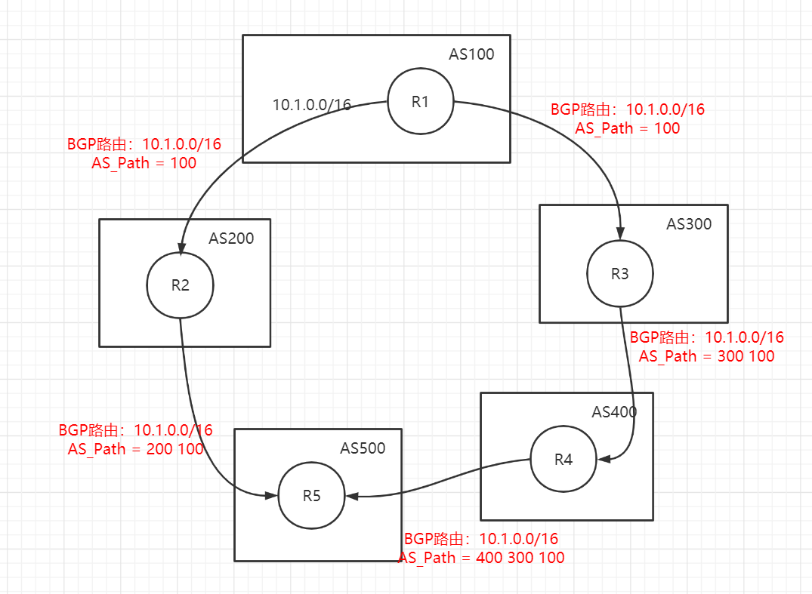

# BGP和Calico的数据流向

## 1. BGP
如果要了解calico的工作原理，首先肯定需要明白BGP到底是干什么的。
BGP是一种外部路由协议（Border Gateway Protocol，简称BGP，亦称边界网关协议），使用的算法是路径矢量路由协议，它是距离矢量路由协议的升级版。

### 1.1 距离矢量路由算法
距离矢量路由是基于Ford算法的，这种算法的基本思路是，每个路由器都保存一个路由表，包含多行，每行对应网络中的一个路由器，每一行包含两部分信息，一个是要到目标路由器要从哪条线出去，另一个是到目标路由器的距离。

每个路由器通过告知自己和邻居之间的距离，在每隔几秒的时间间隔下进行全局路由更新。每个路由器都将自己所知的到达所有路由器的距离告诉邻居，每个路由器也能从邻居哪里得到详细的信息。

每个路由器根据新手机的信息，计算和其它路由器之间的距离，比如自己的一个邻居距离目标路由器的距离是 M，而自己距离邻居是 x，则自己距离目标路由器是 x+M。

但是，该算法会出现**好消息传的快坏消息传的慢**的问题。可以通过下面一张图来解释这个问题：

原来的网络包括两个节点，B 和 C。A 加入了网络，它的邻居 B 很快就发现 A 启动起来了。于是它将自己和 A 的距离设为 1，同样 C 也发现 A 起来了，将自己和 A 的距离设置为 2。但是如果 A 被删掉了，情况就不妙了。B 本来和 A 是邻居，发现连不上 A 了，但是 C 还是能够连上，只不过距离远了点，是 2，于是将自己的距离设置为 3。殊不知 C 的距离 2 其实是基于原来自己的距离为 1 计算出来的。这个过程会持续进行知道超过一个阈值，才可以判定A真的没有了。

而另外一个问题就是，每次更新路由表都要广播发送到整个全局路由表。如果网络比较小还可以勉强接受，但是一旦网络很大，那么这种方法无疑加大了性能损耗。最早的路由协议RIP就是采用了该算法，适用于小于15跳的小型网络。

### 1.2 链路状态路由算法
第二大类就是链路状态路由（link state routing）,基于Dijkstra算法。

这种算法的基本思路是，当一个路由器启动的时候，首先发现邻居，向邻居 say hello（开接口，发送hello包，是基于IP包的），邻居都回复。然后计算和邻居的距离，发送一个 echo，要求马上返回，除以二就是距离。然后将自己和邻居之间的链路状态包广播出去，发送到整个网络的每个路由器。这样每个路由器都能够收到它和邻居之间的关系的信息。当一个路由器挂掉的时候，首先每个邻居会先察觉到，于是将距离清零。然后邻居对外进行广播，更新每个路由器上图的路由信息。

因而，每个路由器都能在自己本地构建一个完整的图，然后针对这个图使用 Dijkstra 算法，找到两点之间的最短路由路径。

不像距离距离矢量路由协议那样，更新时发送整个路由表。链路状态路由协议只**广播更新的或改变的网络拓扑**，这使得更新信息更小，节省了带宽和 CPU 利用率。而且一旦一个路由器挂了，它的邻居都会广播这个消息，可以使得坏消息迅速收敛。

#### 基于链路状态路由算法的OSPF

OSPF(Open Shortest Path First，开放式最短路径优先)主要用在数据中心内部，用于路由决策，所以也称作内部网关协议（Interior Gateway Protocol，简称 IGP）。

OSPF虽然相比RIP来说更能适应中大规模网络（30-50跳），并且路由信息变化的收敛速度很快，且Dijkstra算法保证了不会出现环路等这些优点。但是，OSPF协议过于复杂，对于配置运维无疑是一种挑战。并且，OSPF协议内的路由的负载均衡能力较差，一般需要在应用的接入层配置负载均衡LVS才能够减缓负担，但这无疑又增加了一层配置运维难度。

### 1.3 基于距离矢量路由算法的BGP

BGP也成为外网路由协议，相比于OSPF来说能够承载更大规模的网络。BGP协议使用的算法是路径矢量路由算法，是基于距离矢量路由协议改进的算法。

距离矢量路由算法协议的缺点是收敛慢，但是在BGP里面，除了下一跳hop之外，还包括了自治系统AS的路径。举个例子，根据RIF的那个描述，也就是说B知道C原来能够到达A，是因为路过了B自己，一旦B自己无法到达A（A挂掉），那么B会更新这个路径信息，让C知道这条路径无法到达A，这时候就不需要假设C还能到达A了。这样，RIF存在的问题就得到了解决。

我们可以通过下面这张图来了解BGP在AS之间的路径矢量特征：

AS200收到来自AS100的BGP路由信息，BGP路由为10.1.0.0/16，此时添加一个AS_Path，其值为路径下的AS编号值。对于AS500来说，其下的R5要访问R1，从邻居的AS Path可以看到一条路径是200 100 ，一条是400 300 100，R5会选择路径最优的R5->R2->R1这条发送信息。

对于AS之间的BGP交互，用AS Path这样的路径标识，可以有效防止AS之间出现环路现象，当R1发现邻居路径中存在自己的AS编号，则该条路径肯定是环路路径，故不会从这条路径走。而对于AS内的防环，涉及到IBGP的水平分割和路由黑洞问题，这里不做过多阐述，感兴趣的同学可以自行查阅。

## 2. calico的数据消息流向

### 2.1 安全策略组件和网络包规则流
calico属于纯三层网络，它分配cali-的虚拟网卡给每一个pod，使其通过路由规则能够获取集群node的下一跳地址。Calico中还实现了灵活配置的网络策略Network Policy，可以灵活配置两个容器通或者不通。首先我们来看linux内核的网络包传递。

linux中的安全组，往往都需要走iptables规则，比如说防火墙。上图里的内容是iptables在内核处理网络包的过程中可以嵌入的处理点。而calico也是在这些点上设置的相应规则。

当网络包进入物理机上的时候，首先进入PREROUTING规则链，PREROUTING规则链下有对应的cali-PREROUTING规则，网络包需要从calico的cali-PREROUTING规则来匹配。cali-PREROUTING规则下有cali-fip-dnat规则，这个是实现浮动IP（Floating IP）的场景，主要将外网的IP地址经过DNAT作为容器内的IP地址。

然后进行路由决策，判断路由时走本地的还是走转发的。

如果是本地的，走INPUT规则，这里面有一个规则是cali-wl-to-host，意思是判断从workload(容器)发到物理机的网络包是否符合规则。这是calico自己对于容器访问物理机的网络包判断。这里面内嵌了一个规则，cali-form-wl-dispatch，也是匹配从容器来的包。这往下还有容器网卡的匹配规则，比如说有两个容器，那么会内嵌两个规则：“cali-fw-cali网卡1”和“cali-fw-cali网卡2”，fw就是from workload，也就是匹配从容器1来的网络包和从容器2来的网络包。然后还会有cali-pro-网卡1，并且通过cali-to-wl-dispatch-*这个分发器进行指定网卡的分发。这里细节很多，如果说感兴趣的同学可以根据iptables链一步步找下去。

如果是转发出去的，走FORWARD规则，里面有规则cali-FORWARD。分两种情况会经过这个规则，一个是从容器里面发出来的，转发到外面的；另一种就是从外面发进来的，转发到容器里面的。

第一种情况匹配的规则仍然是 cali-from-wl-dispatch，也即 from workload。第二种情况匹配的规则是 cali-to-wl-dispatch，也即 to workload。如果有两个容器，则会有两个容器网卡，在这里面内嵌有详细的规则“cali-tw-cali 网卡 1”和“cali-tw-cali 网卡 2”，tw 就是 to workload，也就是匹配发往容器 1 的网络包和发送到容器 2 的网络包。

接下来是匹配 OUTPUT 规则，里面有 cali-OUTPUT。接下来是 POSTROUTING 规则，里面有一个规则是 cali-fip-snat，也即发出去的时候，将容器网络 IP 转换为浮动 IP 地址。

