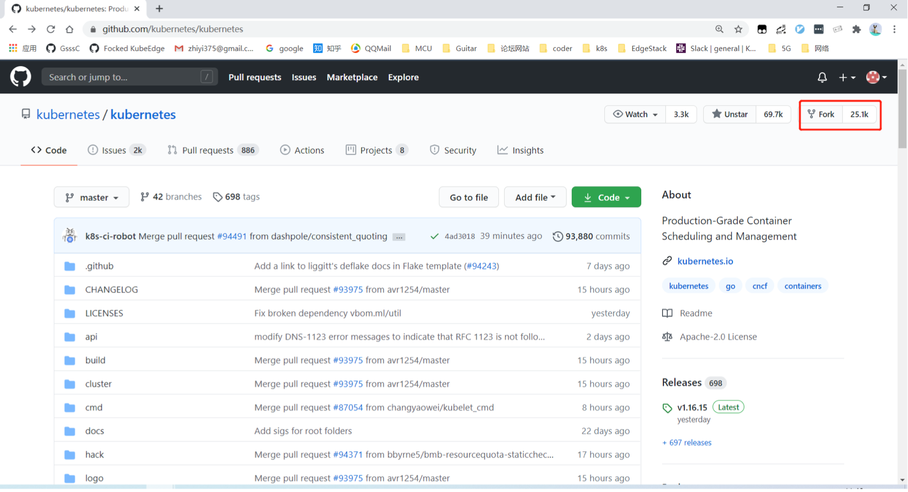
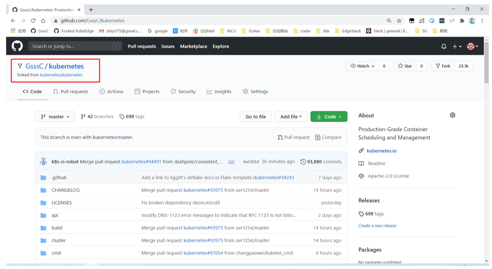
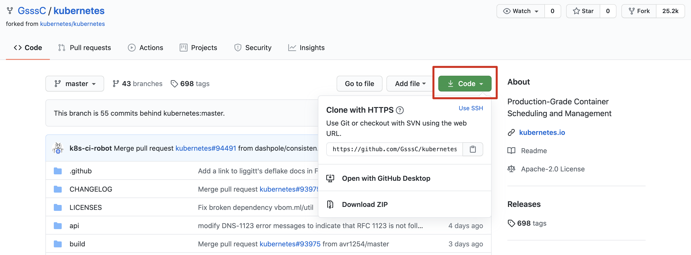
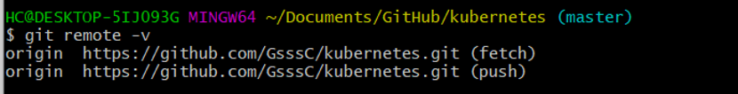
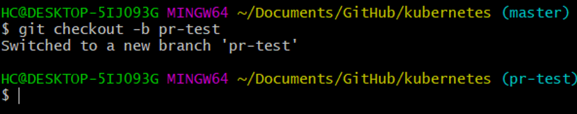
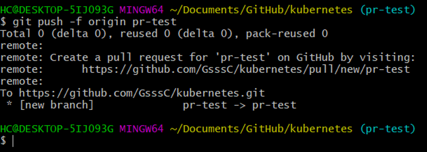
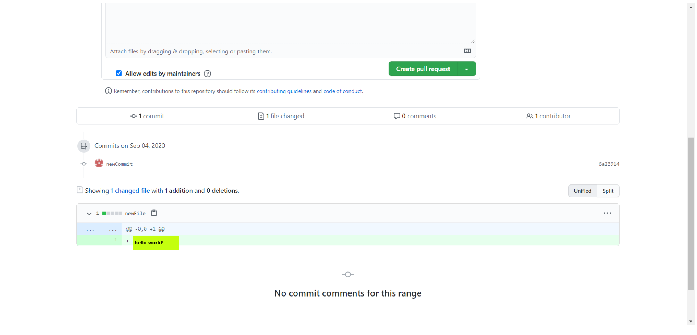

# GitHub Development Guide on Kubeedge

### Git 与 GitHub

Git 是一款免费、开源的分布式版本控制管理系统。类似的代码版本控制系统还有：svn。

GitHub 是用 Git 做版本控制的代码托管平台，我们把代码托管上云，以便于代码保存，多人协作，切换 PC 工作。常见的托管平台还有：Gitee(码云)，GitLab 等。

通俗来讲，代码仓库，Git 和 Github 这三者，类似于电视剧，视频播放技术，爱奇艺这三者关系。而本地代码仓库是云上仓库的一份拷贝，对本地仓库的修改可以通过 push 的方式作用到云上仓库，而引起云上仓库的修改。

通常，组织者及其项目能唯一定位一份代码仓库（组织名/项目目名），如 kubeedge/kubeedge，GsssC/kubeedge，GsssC/selArticle 等。


### Windows 下 Git

- Git（[https://gitforwindows.org/](https://gitforwindows.org/)）：通常使用 git bash，功能强大

- Git Desktop（[https://desktop.github.com/](https://desktop.github.com/)）：可视化界面，但有些需求必须使用 bash 命令完成

两者结合最佳


## Git基础用法 - PR提交

以 kubernetes/kubernetes 的为例子：

如果对某一个开源项目有修改的想法，由于账户无直接 `push` 修改云上 kubernetes/kubernetes 的权限，需要 `fork` 创建一份 GsssC/kubernetes 仓库，创建分支 pr-test，再发起 pr 请求以期将 GsssC/kubernetes/pr-test 分支上的修改合并进 kubernetes/kubernetes/master，pr 请求被社区maintainer（有权限的人）允许后，k8s/k8s/master 分支就会合并进个人的修改。

图解如下：


### 主要流程

- **在 GitHub 中 fork **




在自己 Repositories 中可以看到 forked 仓库：




- **链接仓库**

使用 `git clone` 将 GsssC/k8s 仓库下载到本地：

```shell
git clone https://github.com/GsssC/kubernetes.git
```




**NOTE:**

`git clone` 和 `download ZIP` 的区别：

"clone" uses git software on your computer to download the source code **and it's entire version history**.

"download zip" creates a zip file of **just the current version** of the source code for you to download - the project history is not included.

 

然后使用 `git remote` 以观察本地仓库链接的远程仓库：

```shell
git remote    	//不带选项的时候，git remote命令列出所有远程主机
git remote -v 	//使用-v选项，可以参看远程主机的网址
```





使用 `git remote add` 将 k8s/k8s 仓库链接到本地仓库，并起一个别名 upstream：


`clone` 版本库的时候，所使用的远程主机自动被Git命名为`origin`


_**Q: 为什么需要链接 k8s/k8s仓库？**_

_**A:** forked 的仓库 GsssC/k8s 是 k8s/k8s 的一份云上拷贝，随着时间，GsssC/k8s/master 会落后于 k8s/k8s/master 分支，所以我们需要从 k8s/k8s/master 分支 pull 代码到本地，再 push 至 GsssC/k8s/master ，以维护这两个 master 之间的同步。_


- **更新本地仓库**

首先要明确，pr 是分支到分支的合并请求。为尽量的减少代码冲突，**为 pr 所新建的分支最好是基于当前时刻的 master**。

重新回顾一下下图：


所以在新建分支之前先更新本地仓库 local/master 和 k8s/k8s/master 一致，我们可以通过 `git fetch` 和 `git rebase` 来更新仓库。

先通过 `git fetch` 拷贝更新远端 k8s/k8s/master 至本地，由于 upstream=k8s/k8s，所以执行：

```shell
//一旦远程主机的版本库有了更新（Git术语叫做commit），需要将这些更新取回本地，这时就要用到git fetch命令
//格式：git fetch <远程主机名> <分支名>
git fetch upstream master 
```


这里带*号两行表示 k8s/k8s 下 master 这个分支，写入了 FETCH_HEAD（一份文件，记录了远端仓库有哪些分支已经被拷贝到了本地，最新commit为多少），并把此拷贝分支在本地取名为 upstream/master 。使用 `git branch -al ` 可以看见：


然后，我们通过 `git rebase` 来推进 local/master，在本地分支上合并远程分支：

```shell
git rebase master upstream/master //本地分支+远程仓库分支
```

此时 local/master 已经和 k8s/k8s/master(即 upstream/master ) 一致了。


**NOTE:**

`git pull` = `git fetch` + `git merge`

`git pull --rebase` =  `git fetch` + `git rebase`

从目的来说，两者没差别，运行之后， 能获得一样的 code base 。但从版本管理角度，这两者有各自的使用意义。对比来看，`git merge` 多了一次提交——“合并提交”。`git rebase` 则没有。

其中：

 `git fetch` 只是拉取代码到本地

 `git merge ` 是合并提交，简单来说，它把两条不同分支历史的所有提交合并成一条线，并在“末端”打个结，即**生成一次合并提交**。最后形成一条单一的提交线

 `git rebase ` 根据参数的不同，行为有些差别。但总的来说，它相当于把分叉的两条历史提交线中的一条，每一次提交都捡选出来， 在另一条提交线上提交。最后也形成**一条单一的提交线**


- **创建 PR 分支**

  我们可以通过 `git checkout` 来基于当前分支 local/master ，创建 pr 分支：

  ```shell
  git checkout -b pr-test 
  ```

  


一些有关分支的操作有：

```shell
git branch BRANCH_NAME  			//创建分支
git checkout BRANCH_NAME			//切换分支
git checkout -b BRANCH_NAME  	//创建并切换分支
git branch -d BRANCH_NAME			//删除分支
git branch 										//查看当前分支
git branch -a 								//查看所有分支
git branch -r 								//查看远程分支
```


**NOTE:**

当然，由于 upstream/master 其实就为云上分支的拷贝，`fetch`后直接基于此分支创建 pr 分支也可以：

```shell
git fetch upstream master
git checkout upstream/master //切换分支
git checkout -b pr-test
```


- **发布当前分支至云上 forked 仓库**

 ```shell
//用于将本地分支的更新，推送到远程主机
//格式：git push <远程主机名> <本地分支名>:<远程分支名>
//如果省略远程分支名，则表示将本地分支推送与之存在"追踪关系"的远程分支（通常两者同名），如果该远程分支不存在，则会被新建
git push -f origin pr-test
 ```



随后可以去 GitHub 网站上检查分支是否成功发布：


- **修改分支代码并提交commit**

假设我们修复了一个 bug ，新增了一个 commit ：

```shell
touch newFile
echo “hello world!” > newFile

git commit -m “newCommit”
git push -f origin pr-test
```


- **在 GitHub 项目下提交 PR**

点击 new pull request :


填写描述并 create ：




至此，我们完成了一个 pr 的提交：）


## Git高阶用法 - 回滚


## Git高阶用法 - 合并多个commit


## Git高阶用法 - 冲突解决


## KubeEdge本地 vendor 刷入


(未待完续...)
