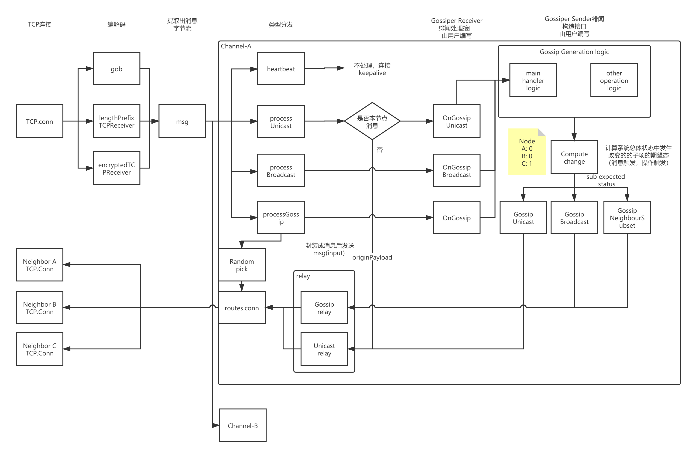

# mesh 分析调研
## 名词解释
  邻居 = 直连
  relay = 转发
## 消息流概览

## mesh 连接与消息格式
- 通信直接基于TCP协议,需要自定义编码规则(从tcp字节流中分隔，读取出消息字节切片)，目前的编码规则有
  1. Golang官方编码gob,gob可以来序列化struct对象。
  2. lengthPrefixTCPReceiver,自定义消息长度的编码规则，msg = [length] + [body]
  3. encryptedTCPReceiver, 前两者均为明文的消息格式，此格式根据tcp.state.sessionkey 将消息编码(加密)，`res.SessionKey = formSessionKey(&remotePubKeyArr, privKey, params.Password)`
  ```go
  func (conn *LocalConnection) receiveTCP(receiver tcpReceiver) {
    var err error
    for {
      if err = conn.extendReadDeadline(); err != nil {
        break
      }
      var msg []byte
      if msg, err = receiver.Receive(); err != nil {
        break
      }
      if len(msg) < 1 {
        conn.logf("ignoring blank msg")
        continue
      }
      if err = conn.handleProtocolMsg(protocolTag(msg[0]), msg[1:]); err != nil {
        break
      }
    }
    conn.shutdown(err)
  }
  ```
- 消息基于字节切片
  ```go
  func (conn *LocalConnection) handleProtocolMsg(tag protocolTag, payload []byte) error {
    switch tag {
    case ProtocolHeartbeat:
    case ProtocolReserved1, ProtocolReserved2, ProtocolReserved3, ProtocolOverlayControlMsg:
      conn.OverlayConn.ControlMessage(byte(tag), payload)
    case ProtocolGossipUnicast, ProtocolGossipBroadcast, ProtocolGossip:
      return conn.router.handleGossip(tag, payload)
    default:
      conn.logf("ignoring unknown protocol tag: %v", tag)
    }
      return nil
  }
  ```
  
  Mesh自定义消息格式(消息类型+body), 目前主要的消息类型有:
  1. ProtocolHeartbeat, 心跳包
  1. ProtocolGossipUnicast, Gossip单播消息
  1. ProtocolGossipBrodcast, Gossip组播消息
  1. ProtocolGossip, 绯闻消息，接收并添油加醋后随机转发至`min(2 log2(n_peers), n_neighbouring_peers)`个邻居节点
  
  且从以下代码可以发现, Mesh Gossip 采用多通道复用技术(一条连接支持多个channel平面, 每个channel维护一套状态量，如路由表等信息)
    ```go
  func (router *Router) handleGossip(tag protocolTag, payload []byte) error {
    decoder := gob.NewDecoder(bytes.NewReader(payload))
    var channelName string
    if err := decoder.Decode(&channelName); err != nil {
      return err
    }
    channel := router.gossipChannel(channelName)
    var srcName PeerName
    if err := decoder.Decode(&srcName); err != nil {
      return err
    }
    switch tag {
    case ProtocolGossipUnicast:
      return channel.deliverUnicast(srcName, payload, decoder)
    case ProtocolGossipBroadcast:
      return channel.deliverBroadcast(srcName, payload, decoder)
    case ProtocolGossip:
      return channel.deliver(srcName, payload, decoder)
    }
     return nil
  }
  ```

## Mesh Gossip 协议分析-接收
### Mesh Gossip 单播逻辑分析
  ```go
  func (c *gossipChannel) deliverUnicast(srcName PeerName, origPayload []byte, dec *gob.Decoder) error {
    var destName PeerName
    if err := dec.Decode(&destName); err != nil {
      return err
    }
    if c.ourself.Name == destName {
      var payload []byte
      if err := dec.Decode(&payload); err != nil {
        return err
      }
      return c.gossiper.OnGossipUnicast(srcName, payload)
    }
    if err := c.relayUnicast(destName, origPayload); err != nil {
      c.logf("%v", err)
    }
      return nil
  }
  ```
  下面分析Mesh Gosssip的单播逻辑，收到一条：
  1. 若该单播消息目的地为本节点(ourself), 接收并发送至上层, `c.gossiper.OnGossipUnicast(srcName, payload)`
  2. 若该单播消息目的地非本节点，根据路由表`c.routes.UnicastAll`, 依次找到下一跳直连节点，找到下一跳直连节点连接，转发，后文着重分析Gossip路由表生成逻辑
  ```go
  func (c *gossipChannel) relayUnicast(dstPeerName PeerName, buf []byte) (err error) {
    if relayPeerName, found := c.routes.UnicastAll(dstPeerName); !found {
      err = fmt.Errorf("unknown relay destination: %s", dstPeerName)
    } else if conn, found := c.ourself.ConnectionTo(relayPeerName); !found {
      err = fmt.Errorf("unable to find connection to relay peer %s", relayPeerName)
    } else {
      err = conn.(protocolSender).SendProtocolMsg(protocolMsg{ProtocolGossipUnicast, buf})
    }
      return err
  }
  ```
### Mesh Gossip 组播协议逻辑分析
  ```go
  func (c *gossipChannel) deliverBroadcast(srcName PeerName, _ []byte, dec *gob.Decoder) error {
    var payload []byte
    if err := dec.Decode(&payload); err != nil {
      return err
    }
    data, err := c.gossiper.OnGossipBroadcast(srcName, payload)
    if err != nil || data == nil {
      return err
    }
    c.relayBroadcast(srcName, data)
    return nil
  }
  ```
  组播的初步逻辑同单播一致，接收本节点消息至上层或转发非本节点消息。
### Mesh 绯闻协议逻辑分析
   ```go
  func (c *gossipChannel) deliver(srcName PeerName, _ []byte, dec *gob.Decoder) error {
    var payload []byte
    if err := dec.Decode(&payload); err != nil {
      return err
    }
    update, err := c.gossiper.OnGossip(payload)
    if err != nil || update == nil {
      return err
    }
    c.relay(srcName, update)
    return nil
  }
  ```
  节点在收到绯闻消息，添油加醋后，随机挑选`min(2 log2(n_peers), n_neighbouring_peers)`个节点转发绯闻
  - n_peers,网络拓扑中的节点总数，注意每个channel平面都有着不同的网络拓扑
  - n_neighbouring_peers, 本节点连接总数
  在一个稀疏的网络拓扑图中，返回拓扑中的大部分节点，极端情况下，返回全部节点。邻居节点也有其邻居，对于拓扑中的关键节点(路由表中频繁出现，消息到达其他节点需要频繁经过)，增加其被挑选的概率

### mesh 关键结构体分析

### mesh 路由

### Gossiper and Gossip 上层处理demo分析


  

