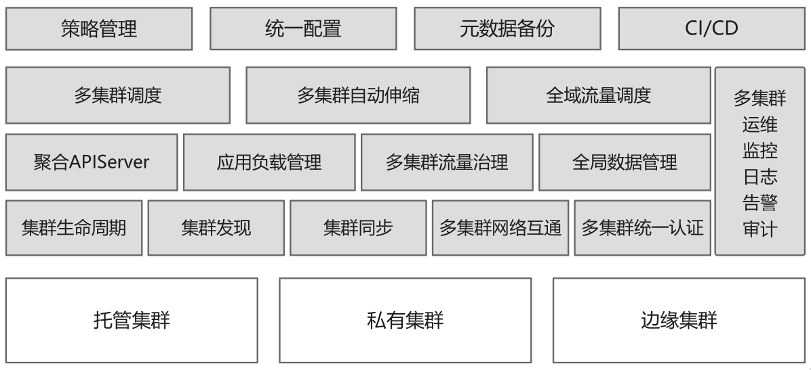
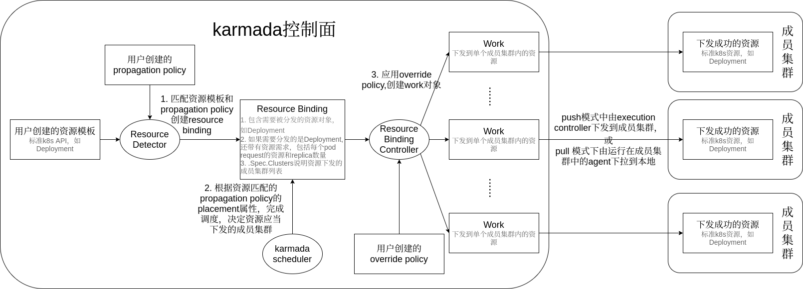

# 从karmada API角度分析多云环境下的应用资源编排：设计与实现

karmada是华为开源的云原生多云容器编排平台，目标是让开发者像使用单个k8s集群一样使用多k8s云。它的第一个release（v0.1.0）出现在2020年12月，而正式发布则是在2021年4月25日，在深圳召开的华为开发者大会（HDC.Cloud）2021上。

karmada吸取了CNCF社区的Federation v1和v2（也称为kubefed）项目经验与教训，在保持原有k8s API不变的情况下，通过添加与多云应用编排相关的一套新的API和控制面组件，方便用户将应用部署到多云环境中，实现扩容、高可用等目标。

> karmada的readme里说this project is developed in continuation of Kubernetes Federation v1 and v2，或许可以把karmada理解为Federation v3

官方网站：https://karmada.io/

代码地址：https://github.com/karmada-io/karmada

使用karmada管理的多云环境包含两类集群：

1. host集群：即由karmada控制面构成的集群，接受用户提交的应用部署需求，将之同步到member集群，并从member集群同步应用后续的运行状况。
1. member集群：由一个或多个k8s集群构成，负责运行用户提交的应用


从下面的karmada功能架构图中我们可以看到，karmada的作用包括多云调度、多云自动伸缩、全域流量调度、多云运维、监控、日志等功能。

本文从karmada API设计和实现角度分析如何在多云环境下实现应用资源的编排，主要关注应用从karmada控制面下发到联邦中的member集群的流程。关于karmada的其他功能会放在后续的文章中。



本文使用的karmada版本为v0.8.0后的commit：18e2649a。

## 1. 多云环境下的应用资源编排API设计

原生k8s API，如`Deployment`并非为多云环境设计，因此缺乏多云环境下应用编排所需要的语义表达能力。诸如应用部署的目的地集群以及在各目的地集群上应用差异化配置等需求都无法在k8s原生API上表达出来。

因此我们需要定义一组新的API，以增强k8s原生API在多云环境下的应用编排语义表达能力。

### 1.1. 历史的回顾：kubefed中的多云应用编排API设计

由于karamda借鉴了kubefed的设计思想，我们先回顾kubefed的多云应用编排API设计。

为了部署一个多云环境下的应用，kubefed可以为`Deployment`等k8s原生API自动生成“多云增强版API”（用CRD定义），比如，用户可以创建下面的例子中的类型为`FederatedDeployment`的custom resource（CR）对象，将nginx运行在两个集群`member1`和`member2`上（这两个集群是kubefed管理下的集群联邦成员，由kubefed的集群配置管理，我们可以暂时不管它们具体定义方法）。
```yaml
apiVersion: types.kubefed.io/v1beta1
kind: FederatedDeployment
metadata:
  name: test-deployment
  namespace: test-namespace
spec:
  template:
    metadata:
      labels:
        app: nginx
    spec:
      replicas: 1
      selector:
        matchLabels:
          app: nginx
      template:
        metadata:
          labels:
            app: nginx
        spec:
          containers:
          - image: nginx
            name: nginx
  placement:
    clusters:
    - name: member1
    - name: member2
  overrides:
  - clusterName: member2
    clusterOverrides:
    - path: "/spec/replicas"
      value: 2
```
在这个对象中我们应当注意三个方面：

1. 资源模板：上面yaml中`.spec.template`部分。这里嵌入了一个标准的k8s原生`Deployment`对象。
1. placement：上面yaml中`.spec.placement`部分，用以说明被嵌入的`Deployment`对象需要被部署到集群`member1`和`member2`中
1. overrides：上面yaml中`.spec.overrides`部分，用以说明被嵌入的`Deployment`对象在部署到`member2`集群上时，应当把`Deployment`的`replicas`从1改为2。

上述`FederatedDeployment`的CRD不需要用户自己编写，用户仅需要使用kubefed的cli工具kubefedctl去"enable" `Deployment`这个k8s原生API资源即可，也就是执行`kubefedctl enable deployment`，kubefedctl就会自动生成CRD并提交apiserver。

似乎kubefed用起来很简单（相对于Federation v1的确简单了不少），然而这里的问题是非k8s原生API。也就是用户被迫改变原有习惯，用一套全新的API（`FederatedDeployment`）来替换k8s原生API（`Deployment`）。因此为了使用kubefed，用户势必需要修改已有的k8s前端管理系统。

### 1.2. 历史的继承：karmada中多云应用编排API的设计

作为后来者的karmada吸取了kubefed“非原生API”方面的教训，将kubefed中定义在同一个API资源对象中的“资源模板”、“placement”、“overrides”拆开成3个如下的单独对象。在karmada中，用户需要分别创建资源模板（resource template）、多云调度策略（propagation policy）和多云差异化配置策略（override policy）3个对象：

首先我们需要定义资源模板对象。为什么称为模板？是因为在每个集群中实际部署的`Deployment`对象都以它为模板创建，但又允许各不相同，详见后续对override policy的描述。
```yaml
apiVersion: apps/v1
kind: Deployment
metadata:
  name: nginx
  namespace: default
  labels:
    app: nginx
spec:
  replicas: 1
  selector:
    matchLabels:
      app: nginx
  template:
    metadata:
      labels:
        app: nginx
    spec:
      containers:
      - image: nginx
        name: nginx
```
我们可以看到，在karmada中用户可以直接使用k8s原生API资源。

其次我们需要定义多云调度策略对象（propagation policy），指定将上述nginx deployment部署到`member1`和`member2`两个由karmada管理的member集群中。在这个propagation policy对象中我们应注意以下几点：

1. `.spec.resourceSelectors`指定了需要部署到member集群中的资源：名叫nginx的deployment
1. `.spec.placement`指定了nginx需要部署到`member1`和`member2`两个member集群中
1. `.spec.dependentOverrides`，表示要karmada控制面等下面的差异化配置（override policy）创建之后再将应用部署到`member1`和`member2`集群。
```yaml
apiVersion: policy.karmada.io/v1alpha1
kind: PropagationPolicy
metadata:
  name: nginx-propagation
  namespace: default
spec:
  resourceSelectors:
    - apiVersion: apps/v1
      kind: Deployment
      name: nginx
  placement:
    clusterAffinity:
      clusterNames:
        - member1
        - member2
  dependentOverrides:
    - nginx-override
```
最后我们需要定义多云差异化配置对象（override policy），指定将部署在`member2`集群中的nginx deployment的replica数量改为2，即需要在`member2`集群中运行2个nginx实例。
```yaml
apiVersion: policy.karmada.io/v1alpha1
kind: OverridePolicy
metadata:
  name: nginx-override
  namespace: default
spec:
  resourceSelectors:
    - apiVersion: apps/v1
      kind: Deployment
      name: nginx
  targetCluster:
    clusterNames:
      - member2
  overriders:
    plaintext:
    - path: "/spec/replicas"
      operator: replace
      value: 2
```
将上述三个yaml用`kubectl apply`提交给karmada控制面后，在使用`karmada-apiserver` context时执行`kubectl get deploy`可以得到如下的输出。虽然READY状态`3/1`的确有些不直观，但这表示利用karmada实现的多云应用下发已经成功，且karmada控制面已经从`member1`和`member2`两个member集群收到pod运行状态：`member1`集群1个pod ready, `member2`集群2个pod ready。作为验证可以分别切换到两个member集群的context，查看pod运行情况。
```sh
$ kubectl get deploy
NAME    READY   UP-TO-DATE   AVAILABLE   AGE
nginx   3/1     3            3           5m8s
```

## 2. 多云环境下的应用资源编排API实现

与k8s中的`kube-controller-manager`类似，karmada中的`karmada-controller-manager`组件基于`sigs.k8s.io/controller-runtime`实现，在单独的goroutine中运行了一系列controller。这些controller配合karmada-scheduler，处理由用户提交的k8s原生API资源（比如前面例子中的`Deployment`）或CRD资源、以及propagation policy、override policy等karmada自定义API资源对象，实现多云环境下的应用资源编排。其中与应用下发相关的controller及它们在应用下发过程中发挥的作用如下：

1. resource detector：监听propagation policy和k8s原生API资源对象（包括CRD资源）的变化，实现两者的绑定。绑定的结果是产生`ResourceBinding`
	> resource detector没有实现`Reconciler`接口，不算`sigs.k8s.io/controller-runtime`框架下的“正规”controller，但却又实现了`Runnable`接口，通过`Add`方法接受controller manager的管理，由controller manager调用它的`Start`方法。另外resource detector代码位于pkg/util包下，并不放在pkg/controllers下，算是个代码异类  
	> 所谓`sigs.k8s.io/controller-runtime`框架下的“正规”controller，需要实现`Controller`接口，它又包含了`Reconciler`接口
1. propagation policy controller：仅有少量检测逻辑：检测propagation policy依赖的override policy是否已经创建，见前面nginx例子中的propagation policy对象的`dependentOverrides`属性。但无论依赖的override policy是否已经创建，propagation policy controller都不会有后续的绑定propagation policy和k8s原生API资源对象（包括CRD资源）的动作。因此可以说propagation policy controller无实际作用。真正的绑定逻辑存在resource detector的`Reconcile`方法中。因此我们后续不再讨论propagation policy controller。
1. resource binding controller：把resource binding转换为work
1. execution controller：把work中包含的k8s原生API资源（或CRD资源）同步到push模式的member集群中（pull模式的member集群会用agent拉取work到本地）

下图描述了karmada中API资源的转化处理流程，以及上述controller在其中扮演的角色。下面按照karmada各组件在该流程中发挥作用的顺序依次描述其流程逻辑。



### 2.1. resouce detector的处理流程

resource detector由karmada controller manager负责启动（调用其`Start`方法）。resource detector负责绑定用户创建的k8s原生API资源对象（包括CRD资源）和propagation policy。该模块的输入是使用list/watch机制监控到的这两类资源的变更事件，而输出是绑定完成的resource binding对象。

resource detector在单独的goroutine中运行一个名为“resource detector”的`AsyncWorker`（定义在`karmada/pkg/util`包下），让它负责处理用户创建的k8s原生API资源对象（包括CRD资源）的增删改事件。当用户创建了一个deployment对象，resource detector会在list/watch的本地缓存中查找是否有匹配的propagation policy（由propagation policy的`resourceSelectors`决定是否匹配），如果能够找到，则表示绑定成功，后续开始生成resource binding对象的流程。如果无法找到，则暂时将该对象放入resource detector的`waitingObjects` map成员中。

resource detector在另外一个单独的goroutine中运行一个名为“policy reconciler”的`AsyncWorker`，让它负责处理用户提交的propagation policy。每当用户创建了新的propagation policy，policy reconciler就会去`waitingObjects`中查找之前没能与propagation policy匹配上的k8s原生API资源对象（包括CRD资源）。一旦发现处于等待状态的之前某个k8s原生API资源对象（包括CRD资源）能够与新创建的propagation policy匹配上，就将它加入resource detector这个`AsyncWorker`的队列中，由resource detector完成后续生成resource binding对象的流程。

当用户创建了多个propagation policy和cluster propagation policy时，resource detector的绑定流程遵循以下优先级：

1. 优先匹配propagation policy，如果无法匹配，再尝试匹配cluster propagation policy
1. 匹配propagation policy时，只选择与当前k8s原生API资源对象（包括CRD资源）同一个namespace下的propagation policy
1. 如果同时存在多个propagation policy或cluster propagation policy与k8s原生API资源对象（包括CRD资源）匹配，则根据propagation policy或cluster propagation policy的name排序，选择排序后第一位的propagation policy或cluster propagation policy

根据绑定的是propagation policy还是cluster propagation policy，resource detector分别调用`ApplyPolicy`或`ApplyClusterPolicy`方法生成对应的resource binding或cluster resource binding对象。这里以`ApplyPolicy`为例分析生成resource binding的流程：

首先为k8s原生API资源对象（包括CRD资源）添加两个label（`ClaimPolicyForObject`方法负责添加）

以前面的nginx deployment为例，执行`kubectl get deploy nginx -o yaml`可以看到两个新加的label：`propagationpolicy.karmada.io/name`和`propagationpolicy.karmada.io/namespace`，分别表示与该deployment绑定成功的propagation policy的name和namespace。
```yaml
apiVersion: apps/v1
kind: Deployment
metadata:
  labels:
    app: nginx
    propagationpolicy.karmada.io/name: nginx-propagation
    propagationpolicy.karmada.io/namespace: default
  name: nginx
  namespace: default
spec:
  selector:
    matchLabels:
      app: nginx
  template:
    metadata:
      labels:
        app: nginx
    spec:
      containers:
      - image: nginx
        name: nginx
```
其次创建resource binding对象。以前面的nginx deployment为例，我们执行`kubectl get rb nginx-deployment`，可以看到resource detector创建的resource binding的yaml，对该yaml说明如下：

1. resource binding对象中同样也添加了绑定成功的propagation policy的name和namespace作为label
1. resource binding的name为绑定成功的k8s原生API资源对象（包括CRD资源）的name加上kind，中间用`-`相连，在这个例子中是`nginx-deployment`
1. `.spec.resource`指定了有需要同步到member集群的资源：也就是名叫nginx的deployment
1. `.metadata.ownerReferences`是用户提交的nginx deployment
1. 需要注意的是当前的resource binding对象的yaml中`.spec.clusters`字段还是空的，也就是还没有明确具体需要调度到哪些member集群中。这个信息需要等下一步的karmada scheduler组件在调度完成之后填充
```yaml
apiVersion: work.karmada.io/v1alpha1
kind: ResourceBinding
metadata:
  labels:
    propagationpolicy.karmada.io/name: nginx-propagation
    propagationpolicy.karmada.io/namespace: default
  name: nginx-deployment
  namespace: default
  ownerReferences:
  - apiVersion: apps/v1
    blockOwnerDeletion: true
    controller: true
    kind: Deployment
    name: nginx
    uid: 80672628-e8c9-462b-933b-037b51d79e59
spec:
  resource:
    apiVersion: apps/v1
    kind: Deployment
    name: nginx
    namespace: default
    replicas: 1
    resourcePerReplicas:
      cpu: "0"
      memory: "0"
```

### 2.2. karmada scheduler（后面简称scheduler）的处理流程

scheduler根据上一步resource detector的输出结果resource binding，通过调度算法决定k8s原生API资源对象（包括CRD资源）的调度结果，即应该调度到哪些member集群中。

scheduler的输入是使用list/watch机制监控的resource binding、propagation policy的变更事件，而输出是为resource binding加上调度结果`.spec.clusters`。

当scheduler的`worker`方法逐一处理内部队列中的resouce binding的更新事件时（这些事件由scheduler定义的不同list/watch handler加入内部队列中），这些resource binding对象可能处于以下几种状态，这些不同的状态决定了scheduler下一步处理流程：

1. 首次调度（`FirstSchedule`）：也就是上一步的resource detector刚创建的resource binding，从未经过scheduler的调度处理。这类resource binding对象的特征是`.spec.clusters`为空
1. reconcile调度（`ReconcileSchedule`）：当用户更新了propagation policy的placement，使得之前已经完成调度的k8s原生API资源对象（包括CRD资源）不得不被重新调度到新的member集群中。这类resource binding对象的特征是之前已经通过scheduler的调度，即`.spec.clusters`不为空，且涉及的propagation policy最新的placement不等于之前调度时的placement。
1. Scale调度（`ScaleSchedule`）：当propagation policy的replica调度策略发生变化，需要重新调度之前已经完成调度的k8s原生API资源对象（包括CRD资源）
1. Avoid调度（`AvoidSchedule`）：当member集群的状态变为不可用

这里重点分析首次调度的处理流程，该流程由scheduler的`scheduleOne`方法定义：

1. 获取resource bindings涉及的propagation policy的placement。由于上一步骤中resource detector为resource binding加上了绑定成功的propagation policy的name和namespace，在这里我们可以找到对应的propagation policy，并获取其placement属性，如前面nginx例子中的placement指定将nginx调度到`member1`和`member2`集群中
1. 根据placement和调度算法完成调度
1. 将调度结果（`SuggestedClusters`）写到resource binding的`.spec.cluster`中
1. 将序列化后的placement写到resource binding的annotation中，annotation的key为`policy.karmada.io/applied-placement`

以前面的nginx deployment为例，执行`kubectl get rb nginx-deployment`，可以看到完成上述调度流程的resource binding对象如下，注意其中由当前步骤中scheduler添加的`.metadata.annotations`和`.spec.clusters`：

```yaml
apiVersion: work.karmada.io/v1alpha1
kind: ResourceBinding
metadata:
  annotations:
    policy.karmada.io/applied-placement: '{"clusterAffinity":{"clusterNames":["member1","member2"]}}'
  labels:
    propagationpolicy.karmada.io/name: nginx-propagation
    propagationpolicy.karmada.io/namespace: default
  name: nginx-deployment
  namespace: default
  ownerReferences:
  - apiVersion: apps/v1
    blockOwnerDeletion: true
    controller: true
    kind: Deployment
    name: nginx
    uid: 80672628-e8c9-462b-933b-037b51d79e59
spec:
  clusters:
  - name: member2
  - name: member1
  resource:
    apiVersion: apps/v1
    kind: Deployment
    name: nginx
    namespace: default
    replicas: 1
    resourcePerReplicas:
      cpu: "0"
      memory: "0"
```

上面的resource binding对象还需要转变为`member1`和`member2`两个member集群中具体的deployment对象，并且如果用户定义了多云差异化配置对象（override policy），我们还需要应用这些override policy。这是一个一对多的转换，该转换工作由resource binding controller配合override manager完成。

### 2.3. resource binding controller的处理流程

在上面的例子中，经过scheduler调度的resource binding包含了需要下发到member集群的deployment对象以及下发的目标集群`member1`和`member2`。resource binding controller还需将这个resource binding转化为两个work（karmada定义的CRD），分别对应`member1`和`member2`。

执行`kubectl get work -A`，可以得到resource binding controller生成的work对象：
```sh
NAMESPACE            NAME               AGE
karmada-es-member1   nginx-687f7fb96f   19m
karmada-es-member2   nginx-687f7fb96f   19m
```

可以看到一个resource binding对象转化成了两个work对象，且两个work对象同名（`nginx-687f7fb96f`）。每个work创建在单独的namespace中（`karmada-es-member1`和`karmada-es-member2`），两个namespace分别对应目的地集群`member1`和`member2`。

执行`kubectl get works nginx-687f7fb96f --namespace karmada-es-member2 -o yaml`,可以看到由resource binding controller的`ensureWork`方法创建的work对象的更多信息：

```yaml
apiVersion: work.karmada.io/v1alpha1
kind: Work
metadata:
  annotations:
    policy.karmada.io/applied-overrides: '[{"policyName":"nginx-override","overriders":{"plaintext":[{"path":"/spec/replicas","operator":"replace","value":2}]}}]'
  creationTimestamp: "2021-09-07T08:17:33Z"
  finalizers:
  - karmada.io/execution-controller
  generation: 1
  labels:
    resourcebinding.karmada.io/name: nginx-deployment
    resourcebinding.karmada.io/namespace: default
  name: nginx-687f7fb96f
  namespace: karmada-es-member2
spec:
  workload:
    manifests:
    - apiVersion: apps/v1
      kind: Deployment
      metadata:
        annotations:
          kubectl.kubernetes.io/last-applied-configuration: |
            {"apiVersion":"apps/v1","kind":"Deployment","metadata":{"annotations":{},"labels":{"app":"nginx"},"name":"nginx","namespace":"default"},"spec":{"replicas":1,"selector":{"matchLabels":{"app":"nginx"}},"template":{"metadata":{"labels":{"app":"nginx"}},"spec":{"containers":[{"image":"nginx","name":"nginx"}]}}}}
        labels:
          app: nginx
          propagationpolicy.karmada.io/name: nginx-propagation
          propagationpolicy.karmada.io/namespace: default
          resourcebinding.karmada.io/name: nginx-deployment
          resourcebinding.karmada.io/namespace: default
          work.karmada.io/name: nginx-687f7fb96f
          work.karmada.io/namespace: karmada-es-member2
        name: nginx
        namespace: default
      spec:
        replicas: 2
        selector:
          matchLabels:
            app: nginx
        template:
          metadata:
            labels:
              app: nginx
          spec:
            containers:
            - image: nginx
              name: nginx
```

对于该work对象说明如下：

1. `.metadata.annotations`说明部署到`member2`集群中的deployment应用了`nginx-override`这个override policy，把replica数量改为2
1. work加上了两个label，表示work由哪个resource binding转化而来
1. `.spec.workload.manifests`中嵌入了需要下发到member2集群中的deployment
1. 嵌入的deployment的label记录了karmada的整个处理流程，包括绑定了哪个propagation policy对象，生成了哪个resource binding对象，最终转化为哪个work对象


至此karmada控制面关于应用下发的逻辑已经完成。后续对push和pull模式的member集群，分别由运行在karmada控制面中的execution controller和运行在member集群中的agent实现work到k8s原生API资源对象（包括CRD资源）的转换，并在member集群中运行起来。
