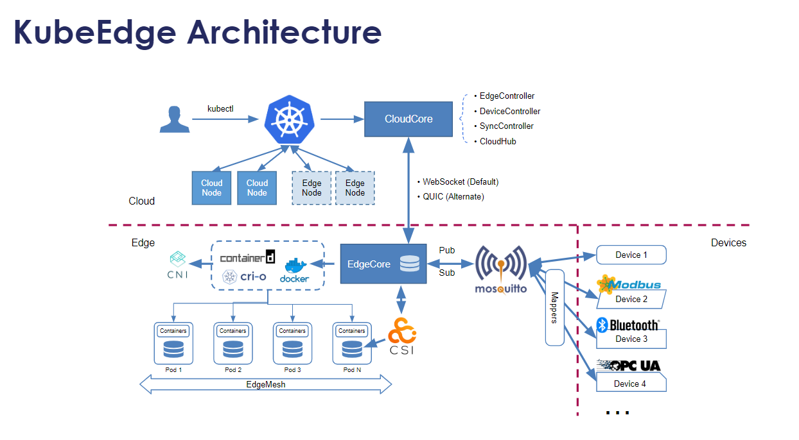
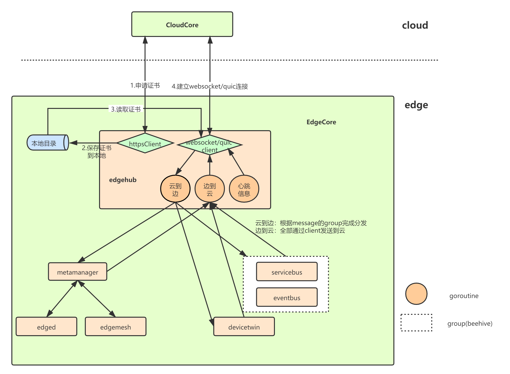
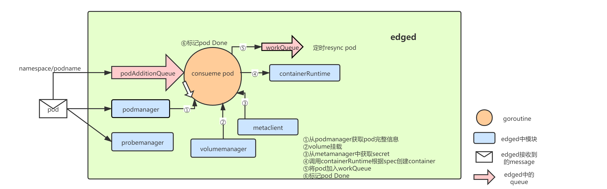
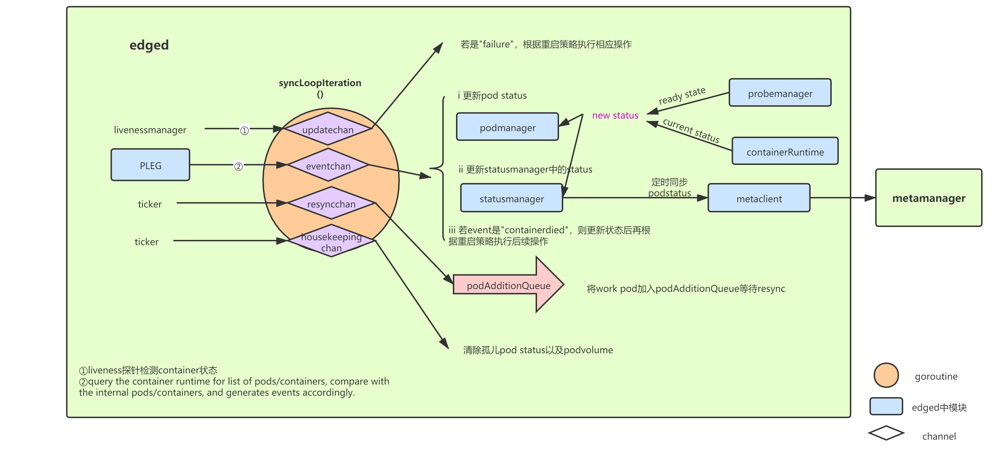

# EdgeCore

本文在commit `a9b0862bed7fc2f9350a850496e60640fc43c15c`之后对KubeEdge进行源码分析，分析KubeEdge的edgecore的整体框架，对细节不做过多展示。

[KubeEdge releases][ https://github.com/kubeedge/kubeedge/releases ]

整个KubeEdge的架构图如下，先感受一下EdgeCore的目标定位。

## EdgeCore是什么？

EdgeCore是kubeedge运行在边缘节点的组件，与云端组件CloudCore通信并处理边缘节点的一切事宜，相当于地方管理者。

EdgeCore支持amd以及arm，不能运行在有kubelet以及Kube-proxy的节点。

## EdgeCore的结构及模块介绍

EdgeCore包括几个模块：Edged、EdgeHub、MetaManager、DeviceTwin、EventBus、ServiceBus、EdgeStream以及EdgeMesh。

与k8s节点上部署的kubelet相比：对kubelet不必要的部分进行了精简，即edgecore中的edged；edgecore增加了与设备管理相关的模块如devicetwin以及eventbus；edgemesh模块实现了服务发现；edgecore将元数据进行本地存储，保证云边网络不稳定时边缘端也能正常工作，metamanager进行元数据的管理。

下面是官方对各个模块的介绍：

- EdgeHub: a web socket client responsible for interacting with Cloud Service for the edge computing (like Edge Controller as in the KubeEdge Architecture). This includes syncing cloud-side resource updates to the edge, and reporting edge-side host and device status changes to the cloud.
- Edged: an agent that runs on edge nodes and manages containerized applications.
- EventBus: a MQTT client to interact with MQTT servers (mosquitto), offering publish and subscribe capabilities to other components.
- ServiceBus: a HTTP client to interact with HTTP servers (REST), offering HTTP client capabilities to components of cloud to reach HTTP servers running at edge.
- DeviceTwin: responsible for storing device status and syncing device status to the cloud. It also provides query interfaces for applications.
- MetaManager: the message processor between edged and edgehub. It is also responsible for storing/retrieving metadata to/from a lightweight database (SQLite).
- EdgeStream
- EdgeMesh: To support service mesh capabilities on edge to support microservice communication cross cloud and edge. The service discovery, communication should be considered in this feature.  

EdgeCore的各个模块之间的通信通过beehive微服务框架（底层实现为channel），EdgeCore与CloudCore之间的通信通过websocket/quic。

### EdgeHub

EdgeHub中有两类client，分别是httpsclient以及websocket/quic client，前者用于与EdgeCore与CloudCore通信所需证书的申请，后者负责与CloudCore的日常通信（资源下发、状态上传等）

当EdgeHub启动时，其先从CloudCore申请证书（若正确配置本地证书，则直接使用本地证书）

初始化与CloudCore通信的websocket/quic client，成功连接之后将成功连接的信息传给其他组件（MetaGroup、TwinGroup、BusGroup），分别启动三个goroutine不断的进行云到边以及边到云的消息分发(单纯分发，不做任何封装或改变)、健康状态上报。当云边传送消息过程中出现错误时，则边缘端重新init相应的websocket/quic client，与云端重新建立连接。

### MetaManager

当metamanager模块启动时，会开启两个goroutine，一个用于定时（默认60s）给自己发送消息通知进行边到云的podstatus数据同步；一个用于edgehub与edged/edgemesh的数据处理。

到达memanager的数据来源于两部分，一是edgehub，此时是云到边的数据，记为①；二是edged，此时是边到云的数据，记为②。

处理的消息类型：

- Insert①
- Update①②
- Delete①
- Query②（configmap/secret/endpoints/PV/PVC/volumeattachment/node，其他资源类型直接到sqlite中查询）
- Response
- NodeConnection（edgehub->其他modules）
- MetaSync（podstatus边到云的同步）

处理的资源类型：

- secret
- configmap
- service
- podlist
- endpoints
- node
- podstatus
- servicelist
- pod
- nodestatus

**Note:**    service/servicelist/endpoints进一步发送给edgemesh供服务发现，其余发给edged进行应用管理

### edged

edged内部模块如图所示：

当edged启动时，首先初始化并启动各个模块，最后进行pod的sync。下面以一个pod的创建来看一下edged中各个模块是如何协作完成pod的生命周期管理的。

当edged接收到pod的insert消息时，将pod所有信息加入podmanager、probemanager，podAdditionQueue加入node-namespace/node-name信息。

启动一个goroutine，创建下发到此节点的pod。

此时我们根据pod的定义成功创建pod，之后还要对pod的状态进行管理。

启动一个goroutine执行syncLoopIteration()函数：

①当liveness探针的结果更新，若内容是“failure”，根据container的restart policy执行相应的操作，比如：`never`->do nothing；`onfailed`->判断container的status，若completed->do nothing，否则将加podAdditionQueue，等待被再次创建；`always`->加入podAddtionQueue，等待被再次创建。

②当收到PLEG的event，更新podmanager中podstatus(containerruntime中获取当前sataus，probemanager更新ready状态)，更新statusmanager中的缓存podstatus。若event是containerdied，则根据restart policy执行相应操作。

另外，statusmanager中会定时(10s)将podstatus上传至metamanager

### servicebus/eventbus/devicetwin

此部分此处不作过多介绍

### edgemesh

和kube-proxy的对比

- kube-proxy
  - 需要list-watch service，从而进行服务发现
  - 容器化部署在每个节点(daemonset)
  - service with cluster IP
- edgemesh
  - 从cloudcore接收service信息，从而进行服务发现
  - 嵌入到edgecore
  - headless service

edgemesh目前功能尚不完善，存在诸多限制，将在v1.4进行完善：

- edgemesh only works for Docker CRI
- Only support HTTP protocol proxy when apps use hostPort 
- Only support IPV4 DNS resolver 

