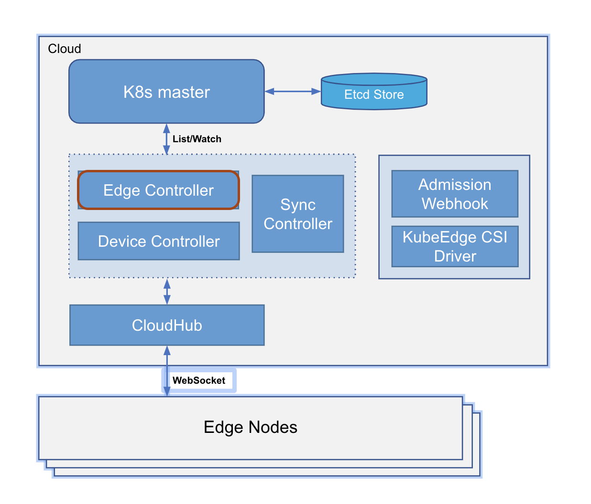
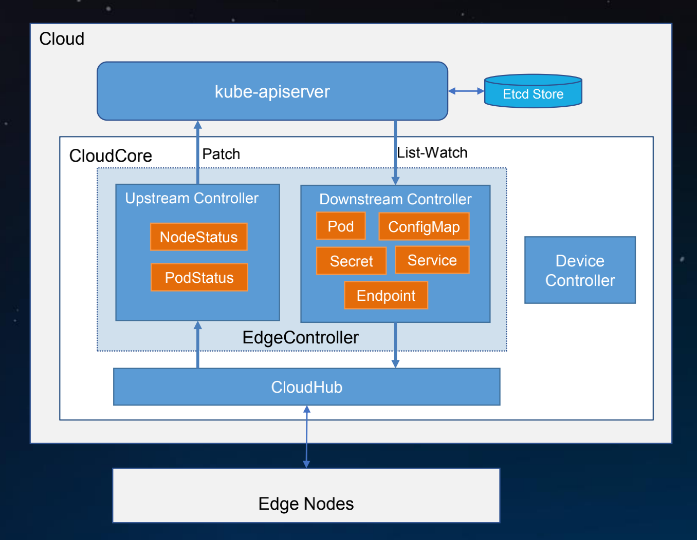
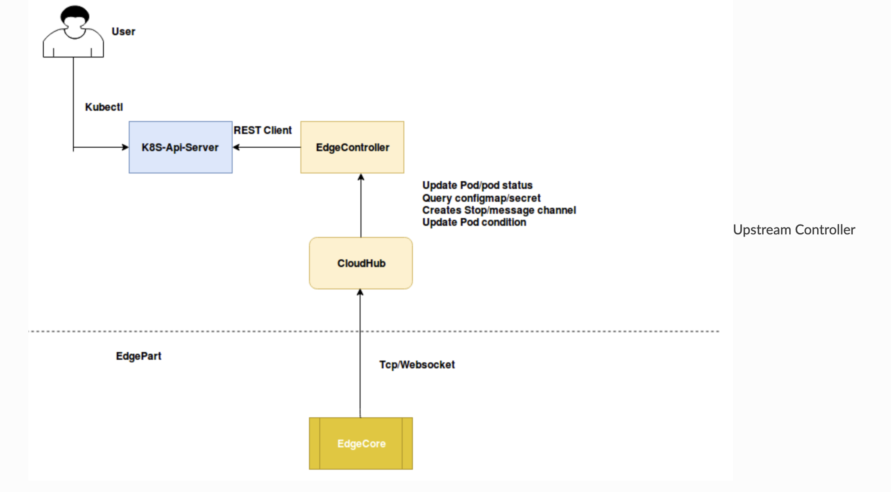

# KUBEEDGE源码分析系列三：云端组件EdgeController分析

## 引文

本文基于KubeEdge官方文档，加上作者的亲身实践，给出以下KubeEdge1.3.0版本下Cloudcore模块中EdgeController模组的源码分析。

## 总览

EdgeController是cloudcore的一个模块，是kubeedge自定义的一个控制器，是连接APIServer和edgecore的桥梁，负责跟踪管理边缘节点上的Node、Pod、ConfigMap等资源从而达到管理边缘节点的目的。



EdgeController内部主要有以下重要结构：

- Downstream Controller：将添加/更新/删除事件从K8s APIServer同步到Edgecore
- Upstream Controller：订阅来自Edgecore的消息，将资源和事件的更新状态同步至APIServer
- Controller Manager：创建管理器接口，该接口实现用于管理ConfigmapManager,、LocationCache、podManager等事件



## 源码分析

EdgeController启动后会分别创建Upstream Controller（以下简称UC）和Downstream Controller（以下简称DC），并运行。UC和DC的结构体略有不同，这里简要分析一下。

UC主要向APIServer Patch边缘节点的最新状态，因此，它包含一个kubeClient以及负责消息封装的MessageLayer.

```go
uc := &UpstreamController{
		kubeClient:   cli,
		messageLayer: messagelayer.NewContextMessageLayer(),
	}
```

DC主要list-watch K8s资源，缓存资源，并生成对应的消息下发到边缘节点，因此，它包含一个kubeClient、负责Watch对应资源的Manager、MessageLayer以及本地缓存，稍后将详细分析各个组件的作用。

```go
dc := &DownstreamController{
		kubeClient:       cli,
		podManager:       podManager,
		configmapManager: configMapManager,
		secretManager:    secretManager,
		nodeManager:      nodesManager,
		serviceManager:   serviceManager,
		endpointsManager: endpointsManager,
		messageLayer:     messagelayer.NewContextMessageLayer(),
		lc:               lc,
	}
```

首先介绍一下UC的工作流程，UC首先创建接收不同资源类型的消息通道，当接收到来自edgecore的消息，解析出对应的资源类型和操作方法,并将消息传入对应的消息通道，之后依次启动4个worker来处理消息通道中的消息。

需要处理的消息主要有以下几种类型：

- updateNodeStatus：更新节点状态，主要有增加节点和更新节点两种操作，UC将根据msg的name去GET K8s中对应的节点/节点状态，若节点不存在，则向APIServer发送CreateNode请求，创建/namespace/name的node；若节点状态不一致，则向APIServer发送UpdateNodeStatus的请求，并向Cloudhub发送成功的Resp。
- updatePodStatus：更新Pod状态，UC将根据msg中Pod资源的name去GET k8s中对应的Pod，若Pod不存在，说明边缘节点的Pod是孤儿Pod，UC将向边缘端发送删除Pod的msg，把边缘端的Pod删除；若存在，则向上更新最新的Pod状态，并更新上次同步状态的时间。
- queryConfigMap：查询ConfigMap，当边缘端向云端发送查询ConfigMap时，UC将直接下发查询的ConfigMap至边缘端。
- querySecret：查询Secret，原理同上。
- queryService：查询Service，原理同上。
- queryEndpoint：查询Endpoint，原理同上。
- queryPersistentVolume：查询PV，原理同上。
- queryPersistentVolumeClaim：查询PVC，原理同上。
- queryVolumeAttach：查询VolumeAttach，原理同上。
- queryNode：查询Node，原理同上。
- updateNode：更新节点的注解。
- deletePod：删除Pod。

总结一下UC的主要作用有以下几点：

1.接收来自edgecore的消息，并将更新同步到K8s-ApiServer

2.创建消息通道以更新Nodestatus，Podstatus，Secret和configmap等相关事件

3.获取Pod Condition信息，例如Ready，Initialized，Podscheduled和Unscheduled详细信息



DC在创建完Manager后初始化locationCache，locationCache负责维护node、pod、configmap、service等资源的映射表。

```go
// LocationCache cache the map of node, pod, configmap, secret
type LocationCache struct {
	// EdgeNodes is a map, key is nodeName, value is Status，维护边缘节点的状态
	EdgeNodes sync.Map
	// configMapNode is a map, key is namespace/configMapName, value is nodeName，维护configMap下发的边缘节点的位置
	configMapNode sync.Map
	// secretNode is a map, key is namespace/secretName, value is nodeName，维护secret下发的边缘节点的位置
	secretNode sync.Map
	// services is a map, key is namespace/serviceName, value is v1.Service，维护service name到实体的映射
	services sync.Map
	// endpoints is a map, key is namespace/endpointsName, value is v1.endpoints，维护endpoint name到实体的映射
	endpoints sync.Map
	// servicePods is a map, key is namespace/serviceName, value is []v1.Pod，维护service name到Pod列表的映射
	servicePods sync.Map
}
```

locationCache初始化的操作主要是：从K8s-APIServer上缓存边缘节点的信息，以及边缘节点上的Pod信息。之后UC开始启动，并对以下资源进行同步：

- Pod
- ConfigMap
- Secret
- EdgeNode
- Service
- Endpoints

资源同步的过程，以Pod为例，负责管理Pod资源的Pod manager会实时watch Pod的最新状态，并找出来自于边缘节点的Pod，根据watch到的event的类型下发相应的消息到边缘节点，同时还需要更新一下lc中与之相关的map，例如如果是添加Pod的操作，需要更新一下Pod使用的cm以及secret的下发的边缘节点的位置，即configMapNode和secretNode这两张表。

总结一下DC的主要作用有以下几点：

1.监视K8s-APIServer并通过cloudHub将更新发送到Edgecore
2.通过cloudHub将（pod，configmap，secret）添加/更新/删除事件同步到边缘
3.创建相应的管理器（pod，configmap，secret）以处理事件
4.找到configmap和secret应发送到哪个节点

