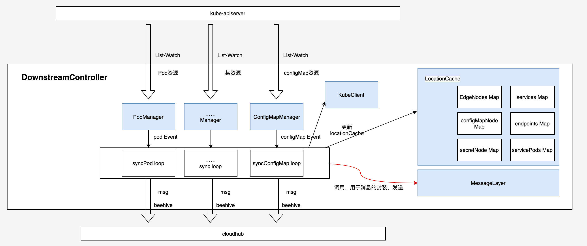
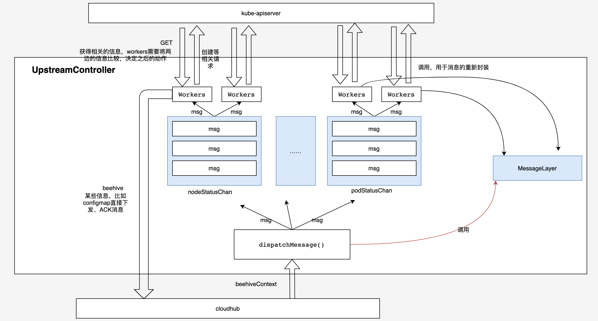

# edgeController实现细节

### 1）downstream

#### 监听下发流程：

#### 6种资源事件具体操作：

- edgeNode 事件：

  | **监听事件**                                                 | **应该达到的状态**                                           | **下发具体的行动**                                           | **本地缓存的更新**                                           |
  | ------------------------------------------------------------ | ------------------------------------------------------------ | ------------------------------------------------------------ | ------------------------------------------------------------ |
  | Add/modified：   有新的 node 加入或者原先的 Node 状态变为可用 | 由于 node 上需要能够获取资源信息，那么需要将集群中 service、pods、endpoints  信息下发到该 node 上 | 一、下发对象：监听到的 node；    二、下发信息：   1）services 信息：本地缓存 services — msg类型为 serviceList，只需要一条 msg；    2）pod 信息：本地缓存 servicePods — msg 类型为 podList，有几个 svc 对应几条 msg；    3）endponts 信息：本地缓存 endpoints — msg 类型为 endpointsList，只需要一条 msg； | 1）EdgeNodes：   （EdgeNodeName,    Status[True/False/Unknow]） |
  | delete：   删除了 edgeNode                                   |                                                              | 一、下发对象：监听到的 node；    二、下发消息：  1）Node信息：msg类型为node，内容为空，只需要一条msg |                                                              |

- pod 事件：

  | **监听事件**        | **应该达到的状态**                                         | **下发具体的行动**                                           | **本地缓存的更新**                                           |
  | ------------------- | ---------------------------------------------------------- | ------------------------------------------------------------ | ------------------------------------------------------------ |
  | Add/modified/delete | 将监听到的 pod 状态下发到 scheduler 为其指定的 edgeNode 上 | 一、下发对象： pod.Spec.Node，即此pod调度的node    二、下发信息：  1）Pod信息：监听到的pod状态 — msg 类型为Pod，只需要一条msg； | 1）configMapNode：   （<configMap_namespace>/<configMap_name>, []string{pod.Spec.NodeName}）    2）secretNode：    （< secret_namespace>/< secret _name>, []string{pod.Spec.NodeName}） |

- service 事件：

  | **监听事件**         | **应该达到的状态**                                           | **下发具体的行动**                                           | **本地缓存的更新**                                          |
  | -------------------- | ------------------------------------------------------------ | ------------------------------------------------------------ | ----------------------------------------------------------- |
  | Add/modified/ delete | 在集群的每一个节点上都能够访问svc，所以在每个节点上都需要存在svc的信息 | 一、下发对象：    所有的边缘节点    二、下发信息：  Service信息：监听到的svc状态— msg类型为service，一个node只需要一条信息 | 1） services：  （service.namespace/service.name, service） |

  【注意】 svc 相关的 pod 信息是由 endpoints 更新的时候才下发的。

- endpoints 事件：

  | **监听事件** | **应该达到的状态**                                           | **下发具体的行动**                                           | **本地缓存的更新**                                           |
  | ------------ | ------------------------------------------------------------ | ------------------------------------------------------------ | ------------------------------------------------------------ |
  | Add/modified | 同service一样，endpoints需要下发到所有的边缘节点上。还需要将endpoints对应的svc的所有相关pod信息发送下去 | 一、下发对象：  所有边缘节点     二、下发信息：  1）  endpoints消息：监听到的eps状态— msg类型为endpoints，一个node只需要一条信息；  2） pod消息：etcd中与该endpoints关联的svc相关的pods信息— msg类型为podList，一个node只需要一条信息 | 1）endpoints：  （endpoints.name space/endpoints.name, endpoints）；  2）servicePods：  （service namespace/service.name, []v1.Pod） |
  | delete       |                                                              | 一、下发对象：  所有边缘节点     二、下发信息：  1）endpoints消息：监听到的eps状态— msg类型为endpoints，一个node只需要一条信息 | 同上                                                         |

- configMap 事件：

  | **监听事件**         | **应该达到的状态**                                       | **下发具体的行动**                                           | **本地缓存的更新**                                           |
  | -------------------- | -------------------------------------------------------- | ------------------------------------------------------------ | ------------------------------------------------------------ |
  | Add/modified/ delete | ConfigMap有变化的话，需要下发到使用这个configMap的Node上 | 一、下发对象：  使用这个configMap的nodes（具体使用的是node上的pod）     二、下发信息：  1）configMap信息：监听到的configMap状态— msg类型为configMap，一个node只需要一条信息 | 1）只有事件为delete时，才更新：  configMapNode：   （<configMap_namespace>/<configMap_name>, []string{pod.Spec.NodeName}） |

- secret 事件：

  同 configMap 事件

### 2）upstream

#### 工作流程

