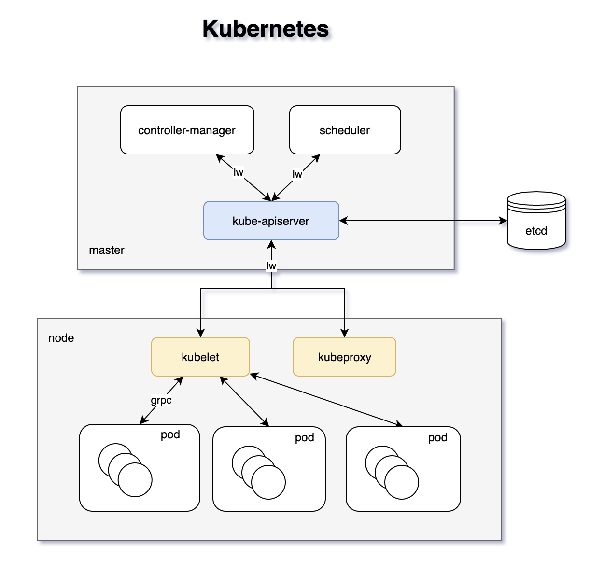
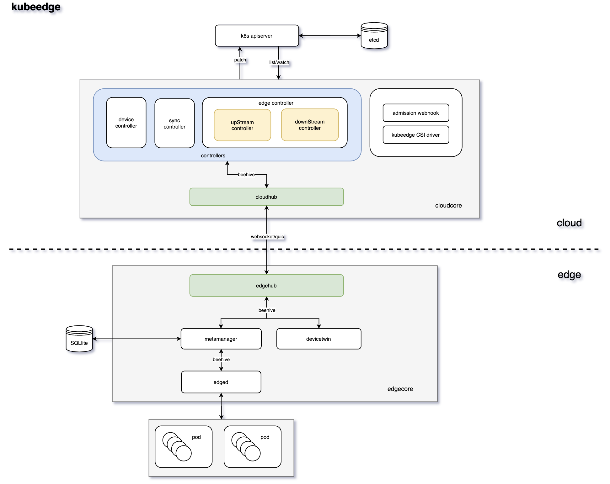
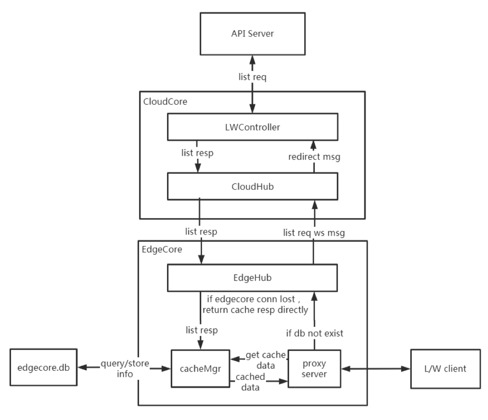
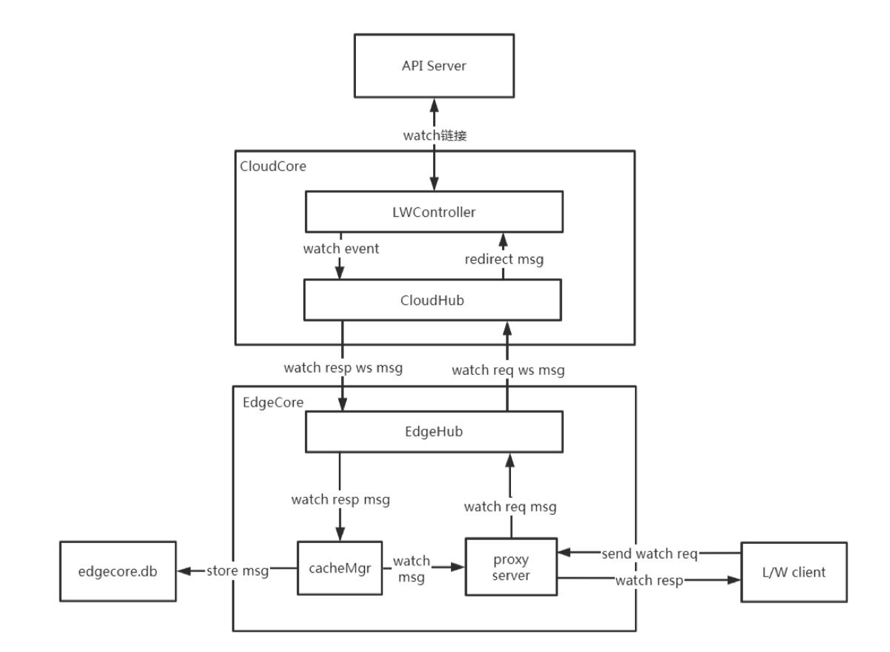
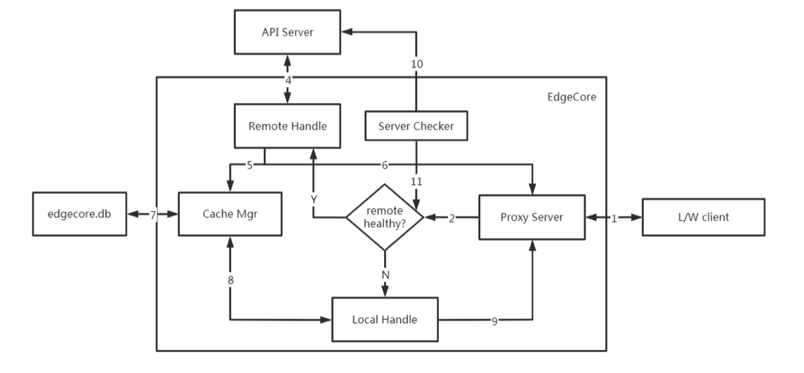
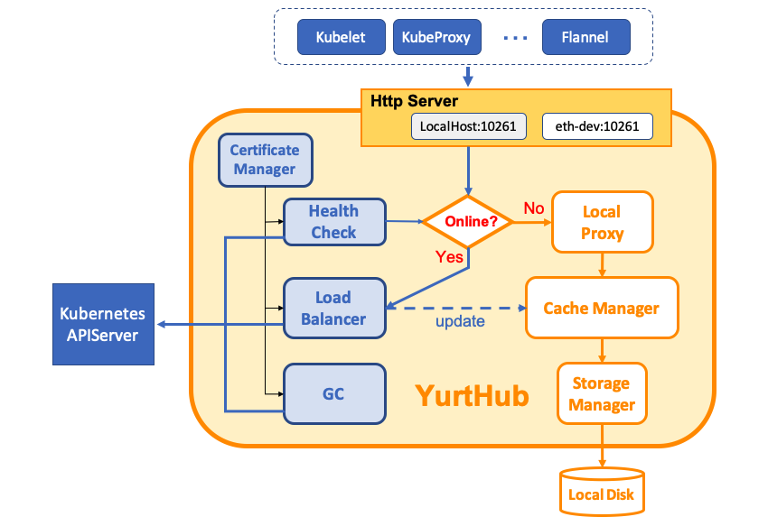
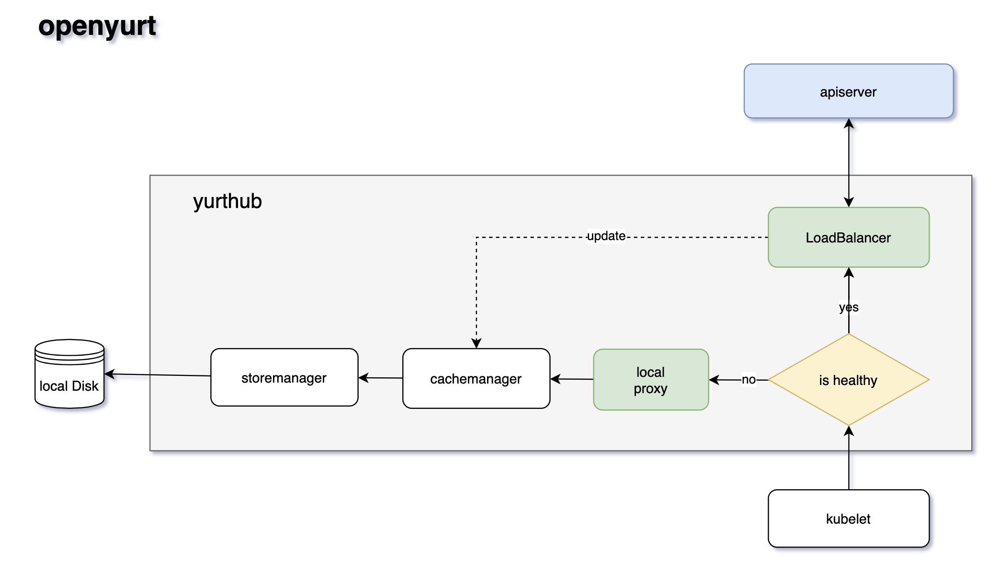
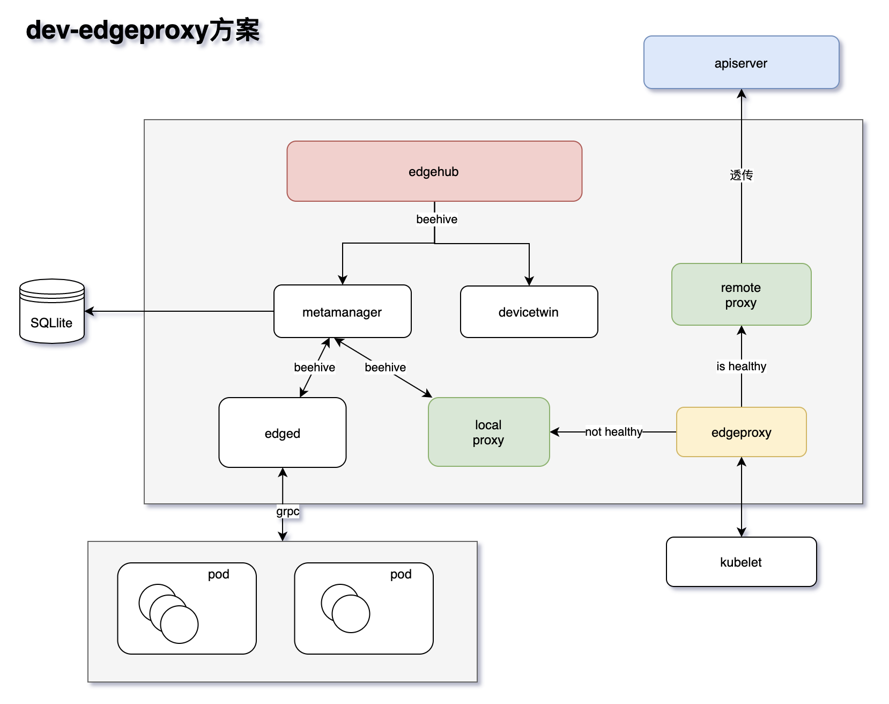
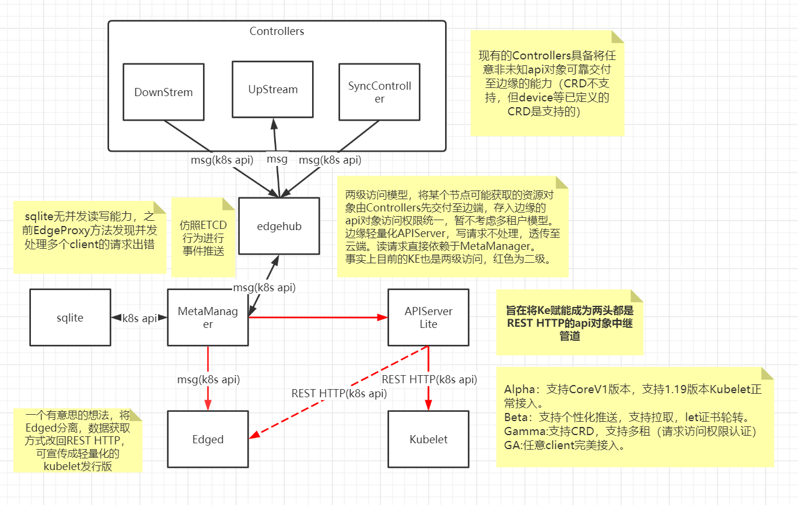
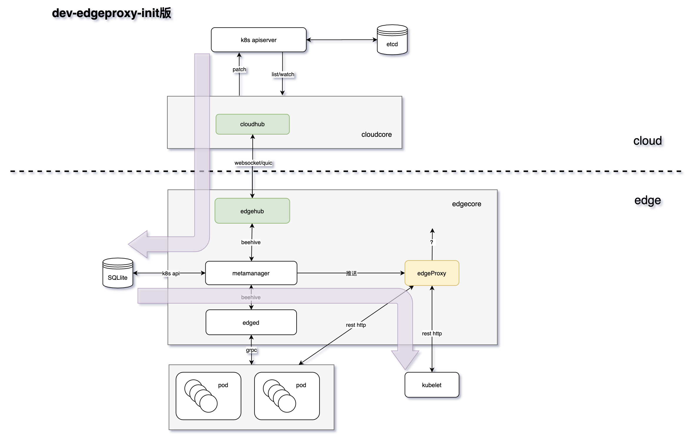

# Proposal for Edgeproxy

## 问题背景

原Kubernetes中，kube-apiserver与node节点的kubelet（以及kube-proxy、calico等组件）之间直接通过list-watch机制进行通讯（rest http），kubelet汇报node.status、pod.status等信息给API Server（上行），同时接收由API Server发送来的对象变更的同步信息（下行），然后kubelet通过grpc框架与容器运行时进行通行。

但是在边缘计算场景中，云边网络环境可能不是很好，会有经常断连的情况发生，这种情况下，list-watch就不能良好的服务于云边的网络环境，为什么呢？

- 事件传输没有类似ACK的验证机制，并且依赖于像数据中心这样的稳定网络
  - List-watch机制只管推送更新事件，该事件在云边网络环境中因断连等原因丢失后接收端无法感知
- 每次网络断开连接时，list-watch客户端都会重新发送列表请求，以从API Server检索完整数据。 在网络波动的情况下，这会给网络和API Server增加很大的压力

因此，在思考边缘侧组件（如kubelet、kube-proxy、caliconode等）与云侧API Server通讯问题时，我们想要在edge端支持list-watch，就需要重新设计一个方案来保证数据的传输可靠性，我们的期望目标是：

- 避免边缘的其他服务直接与API Server产生通信
- 边缘节点需要对数据建立缓存或者落库处理，以增强服务重启或者节点宕机恢复之后的自治能力
- list-watch所能查看的资源对象不应局限于Kubernetes内置的资源对象，对CRD要友好支撑

## Kubeedge现状

Kubeedge中EdgeCore的设计避免了Kubernetes原生的kubelet对pod、ConfigMap、Secret等组件的list/watch操作，采用了通过云端CloudCore进行统一的list/watch，由CloudCore分发消息到EdgeCore。避免了EdgeCore直接的对API Server进行list/watch，同时在边缘节点进行数据的持久化存储，用于支撑边缘节点的离线自治。

本质上是发布订阅模式，连接在代理处有一层收敛聚合，新增了cloudcore来维护边缘节点有关api的状态，里面包括：

- cloudhub：负责上下行消息传递

  controller-------[beehive chan]------cloudhub-------[websocket/quic]--------edgehub------[beehive chan]------metamanager----[beehive chan]----edged

  cloudhub与edgehub之间的传递使用了websocket/quic，这两者和http是同一层次的通信协议。

  - 这边可以应对云边弱网络环境是因为cloudhub针对API Server的不足，为保障交付做了可靠性传输，与websocket本身无关。使用什么协议通信不是重点，重点是如何保障当着之间的链路都无法保障的时候，业务不受到影响。其中相关设计包括KeepaliveInterval心跳检测间隔、MessageAcks消息确认、syncController慢循环等
  - 这里为什么不使用http是因为集群中资源对象的变化（crud）会持续产生消息，推送到边缘侧，但是http v1对并发长连接支持不好，并且在消息模型中，http是单向协议，只有客户端向服务器请求之后服务器才能发送数据，而websocket是双向通信协议，双方都可以向对方发送/接收数据

消息到达edgehub之后会放至metamanager（通过beehive获取api对象），MetaManager先存入sqlite再通过beehive channel传送到edged，然后edged去管理pod生命周期

反向/上行是原路返回（websocket/quic）

### 问题

KubeEdge设计考虑的场景主要为LightEdge场景，由于修改了API数据获取方式（即模块间采用了beehive channel方式），无法支持原生kubelet（原生kubelet不支持beehive msg）。

- why beehive？

  KubeEdge中beehive实现了一套Module管理的接口，程序中各个模块的启动、运行、模块间的通信等都是由其统一封装管理。在beehive中，模块间通信是通过channel来实现的，这也是golang推荐的goroutine间通信的方式。

  相比于进程间通信方式rest http，beehive是协程间继续golang channel的通信方式，后者更加轻量。

现有的组件也只有edged（简化版kubelet）实现了beehive msg接口，能获取到MetaManager里的API对象，其他组件如edgemesh（原Kubernetes的kube-proxy）的功能很弱，且现在没有原calico-node的实现（ke容器均基于宿主机网络，没有容器网络平面）。而在HeavyEdge场景下，原生组件如kubelet，kubepeoxy，caliconode等也想要获取API对象却没能力。

## 解决方案构思

### 方案一：云上代理（CloudCore消息分发方式）

充分复用CloudCore与EdgeCore打通的消息分发内容。在EdgeCore上启动 proxy server直接对外提供list/watch接口，list和watch请求的数据从本地的cacheMgr中过来。

#### list请求

在本地的cacheMgr内没有数据时，通过EdgeHub向CloudCore发送list消息， 然后由LW Controller完成list请求的发送。

#### watch请求

直接由proxy server经EdgeHub 和CloudHub的消息通道发送消息到LWController，LWController建立watch请求，实时的将资源对象更新内容下发到指点节点，cacheMgr持久化保存数据并将消息传递给proxy server，proxy server进行watch结果的传递。

#### 关键组件

proxy server：list/watch服务器，对外提供list watch机制

cacheMgr：缓存管理器，可与metaManager组合，实现已有数据的缓存机制

LWController：LW控制器，完成非pod、configmap、svc等资源的list和watch请求，而pod、configmap、svc、secret、endpoint、endgnode等资源的监听已经在EdgeController里实现（更多API对象信息详见：[API Reference](https://v1-18.docs.kubernetes.io/docs/reference/generated/kubernetes-api/v1.18/#-strong-api-overview-strong-)）

#### 说明

- proxy server需感知edgehub是否与cloudhub连通
- list请求依赖本地缓存，对于单独调用list请求的服务不友好，存在缓存失效问题
  - 如果是纯粹的list请求，向云端请求一次，获取了之后，由于没有watch请求存在，导致边端数据没有再更新，这样子下次在去list全量的时候，直接使用本地数据，可能会丢失上次list之后的更新（考虑第二次list的时候现和云端进行同步）
- cloudcore重启，lwcontroller的watch请求会丢失连接，如何确保edgecore存在的watch连接同步在cloudcore也存在

### 方案二：直连（API Server代理方式）

也就是现dev-edgeproxy版本的实现，与openyurt实现思想类似。

该方案整体是在EdgeCore上建立代理服务器（Proxy Server），通过代理服务器完成与API Server的通信。为了达到离线自治的目的，需要同时构建本地处理请求（Local Handle）和远程处理请求（Remote Handle）两种机制。

- 远程处理请求时，将请求直接转发给API Server，但需要拦截请求结果，将请求结果再加工，response内容复制为两份，一份入缓存，一份返回客户端。（这里拦截请求再加工是在remote handle，所以云上流量很大是个问题）
- 本地处理list请求时，直接访问本地缓存内数据，如果是watch请求则直接返回

#### 关键组件

Proxy Server：http服务器，做List/Watch代理访问入口使用，主要用于根据Server Checker检查云端API Server是否可用来决定将请求转向Remote Proxy还是 Local Proxy访问。 

Remote Proxy：API Server的代理服务器，将list/watch转发到云端API Server进行处理， 拦截请求的响应结果，将结果返回给客户端的同时发送到本地缓存，构建缓存对象，供节点离线时使用。 

Local Proxy：本地代理服务器，在云端API Server不可访问时，本地自治服务，主要访问本地缓存内数据。 

Server Checker：API Server检查器，周期性检查API Server是否可达，将API Server是否可达状态更新到ProxyServer内。 

Cache Mgr：本地缓存管理器。主要用于构建和管理list/watch的本地缓存数据。

#### openyurt对应实现

在edge上部署了yurthub来代理从edge发往apiServer的所有请求，在响应转发到客户端时，在本地持久化响应，当云边缘网络中断并且客户端依然向代理发送请求时，使用本地数据构建响应。

这里只能是edge发往API Server，也就是local disk里的内容取决于kubelet发出的请求内容。

#### dev-edgeproxy方案对应实现

和openyurt类似，请求响应模式，适配Kubernetes rest api 请求，client通过edgeproxy直接透传到apiServer，因此合不进当前ke的Kubernetes master+cloudcore架构中。

### 方案对比

|                        | 优点                                                         | 缺点                                                         |
| :--------------------- | :----------------------------------------------------------- | ------------------------------------------------------------ |
| Cloud Core消息分发方式 | 可复用现以存在的pod、cofigmap等数据 无需构建额外的通信内容 | 所有边缘节点的watch请求统一由CloudCore与API Server建立连接，可能会成为瓶颈阻塞点 针对仅list请求的client，缓存的更新需要进一步设计（缓存失效） 边缘的watch请求与远端watch请求的确保需要进一步设计 |
| API Server代理方式     | 对l/w client友好，可无差异对待所有的资源对象 优先使用最新云端数据，时效性好 | EdgeCore与API Server直接通信，与当前通过CloudCore与API Server通信相矛盾 |

## 目标方案（edgeproxy-init版）

整体是cloudcore分发方案的改进。

新增API Server lite，MetaManager中的变更信息可以推送至API Server lite，由API Server lite通过rest http传输给原生的kubelet，由此支持原生kubelet，以及之后更多的组件。

### 方案细节

- 两级访问模型（图中两条紫色线条）

  某个节点想要获取的资源对象由controllers交付至边端，存入SQLlite；MetaManager会监视SQLlite的更新并将事件推送给API Server lite（代理服务器如edgeproxy），API Server lite再将事件推送给lw client。

  - 对比cloudcore分发方案，list的时候此方案只访问本地，本地无数据则返回，cloudcore分发方案优先访问本地，本地无数据则想cloudcore发送list信息；watch的时候此方案由MetaManager推送SQLlite的更新事件，cloudcore分发方案由代理服务器经过edgehub和cloudhub的通道发送watch消息到云端。此方案整体降低了对云的访问压力。
  - 对比openyurt的实现方案，二级访问模型的存在使得SQLlite的内容是取决于cloudcore的推送，与kubelet无关。

- 当kubelet进行list/get/watch的时候（read操作）只会访问本地SQLlite，SQLlite和云上etcd会保持同步；而当其进行create/delete/update的时候（write操作）必须与云端通信，此处通信细节有待商榷。

  - 想法1：代理服务器直接对接API Server，现阶段实现也是如此实现，client在write失败之后会重试
  - 想法2：先推送到本地SQLlite，本地想办法和云上同步，或者edgeproxy经edgehub推送到云端，但以上两者都涉及权限泄露问题（边缘client的操作权限变成了cloudcore的权限，由此权限升级了）

### 待解决问题

- client写操作有什么比较好的实现方案？
- 怎么触发SQLlite和云端etcd的同步？（beta版本实现）
  
- 可能和目前的edgecontroller类似，edgecontroller目前就自启动了对6种api的listwatch。beta版本有一种思路就是，如果cloudcore需要下发新种类的api对象，它就建立新的lw连接。
  
- SQLlite并发读写出错问题？

  

### 目标方案 vs OY方案

|                                      | 优点                                                         | 缺点                                                         |
| :----------------------------------- | :----------------------------------------------------------- | ------------------------------------------------------------ |
| 目标方案 （cloudcore分发改进）  | 1.可复用现以存在的pod、cofigmap等数据 2.无需构建额外的通信内容 3.边缘节点lw直接访问本地，降低了对云的访问压力 4.当处于恶劣环境下的边缘节点宕机的时候可以由云上下发任务解决 | ~~1.所有边缘节点的watch请求统一由CloudCore与API Server建立连接，可能会成为瓶颈阻塞点~~**（解决：节点lw访问本地） **2.针对仅list请求的client，缓存的更新需要进一步设计（缓存失效） 3.边缘的watch请求与远端watch请求的确保需要进一步设计 |
| openyurt方案 （API Server代理） | 1.对l/w client友好，可无差异对待所有的资源对象 2.优先使用最新云端数据，时效性好 | ~~1.EdgeCore与API Server直接通信，与当前通过CloudCore与API Server通信相矛盾~~ 2.当处于恶劣环境下的边缘节点宕机的时候需要人工解决 |

### 具体实现

Pending.....

