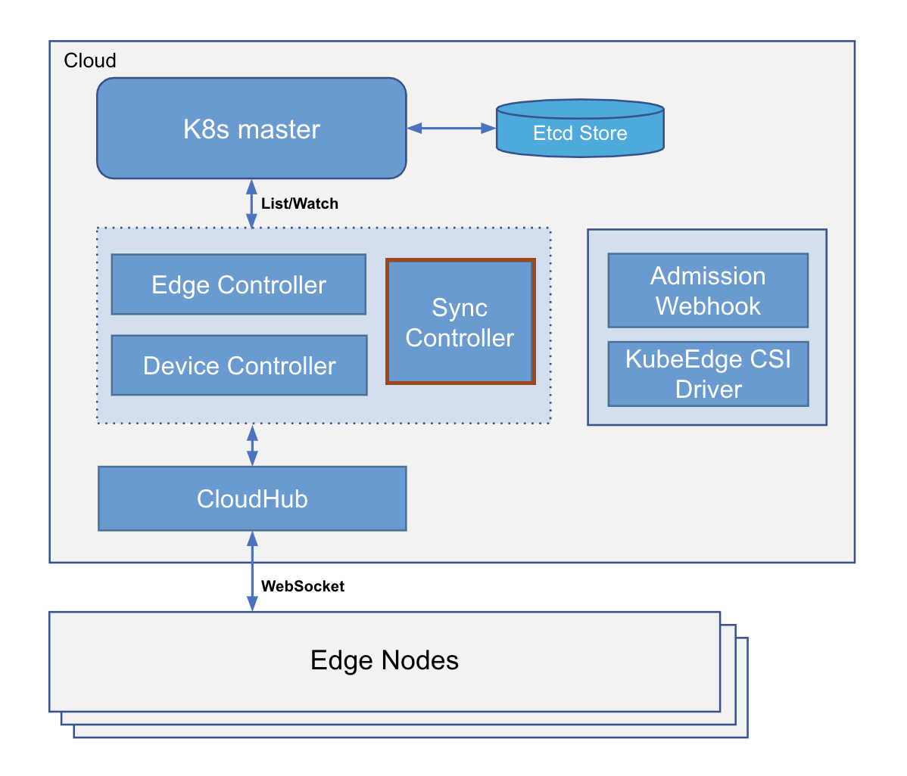

# KUBEEDGE源码分析系列四：云端组件SyncController分析

## 引文

本文基于KubeEdge官方文档，加上作者的亲身实践，给出以下KubeEdge1.3.0版本下Cloudcore模块中SyncController模组的源码分析。

## 总览

SyncController是cloudcore的一个模块，是kubeedge自定义的一个控制器，主要负责云边数据的实时同步，同时确保了云边消息传递的可靠性。

SyncController主要管理以下云边需要实时同步的资源，并为这些资源提供list-watch所需的Informer、Lister等接口：

- Pod
- ConfigMap
- Secret
- Service
- Endpoint
- Node
- Device（kubeedge自定义）
- ClusterObjectSync（kubeedge自定义）
- ObjectSync（kubeedge自定义）

## 源码分析

SyncController在启动后会持续调用资源的Informer从K8s-Apiserver以及K8s-CRD中获取最新的资源对象，并存储到本地的缓存中，同时它会每隔5s进行同步的操作。

同步的主要操作如下：

1.通过List全量获取ClusterObjectSync CRD对象，将Cluster范围的已更新到边缘端的资源对象与K8s中的资源对象进行比较，发现不一致的情况将生成更新和删除事件到边缘。（此部分尚未实现）

2.通过List全量获取ObjectSync CRD对象，将Namespace范围的已更新到边缘端的资源对象与K8s中的资源对象进行比较，发现不一致的情况将生成更新和删除事件到边缘。

3.当Cloudhub发往边缘端的事件发送失败后，SyncController会负责处理这些失败的事件。

1、2两步同步的具体流程如下：

当Cloudhub第一次发往边缘端的事件发送失败时，SyncController将重新创建，这里SyncController仅关注Pod、Service、Endpoint这些资源，因为一旦出现Pod被成功下发，ConfigMap和Secret却找不到的情况，边缘端将会访问云端来查询这两个资源。

SyncController会list获得K8s所有Pod并遍历所有Pod，从中取出所有边缘节点上的Pod，若这些Pod未下发至边缘端（未存储CRD）时，则会生成Pod对象并下发到边缘端。

