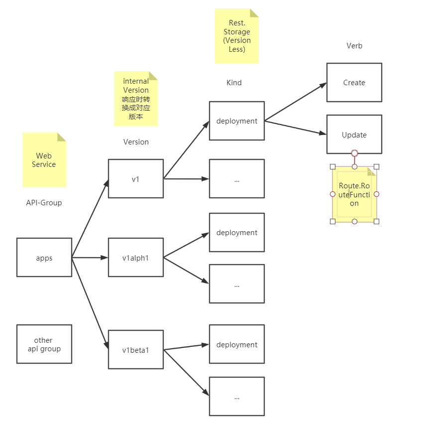

#kube-apiserver 路由分析
## kube-apiserver的httpserver
kube-apiserver的handler的分析首先要关注http.Server的创建和启动

https://github.com/kubernetes/kubernetes/blob/e1a8adb6b64c49ab0b37a096f2316f583aba39dc/staging/src/k8s.io/apiserver/pkg/server/secure_serving.go#L147
```go
	secureServer := &http.Server{
		Addr:           s.Listener.Addr().String(),
		Handler:        handler,
		MaxHeaderBytes: 1 << 20,
		TLSConfig:      tlsConfig,
	}
```
https://github.com/kubernetes/kubernetes/blob/c2d15418316e9a02bf5692de80064556fb4f89f0/staging/src/k8s.io/apiserver/pkg/server/secure_serving.go#L236
```go
	go func() {
		defer utilruntime.HandleCrash()

		var listener net.Listener
		listener = tcpKeepAliveListener{ln}
		if server.TLSConfig != nil {
			listener = tls.NewListener(listener, server.TLSConfig)
		}

		err := server.Serve(listener)

		msg := fmt.Sprintf("Stopped listening on %s", ln.Addr().String())
		select {
		case <-stopCh:
			klog.Info(msg)
		default:
			panic(fmt.Sprintf("%s due to error: %v", msg, err))
		}
	}()
```
## GenericAPIServer.Handler
http.Server的入口Handler是GenericaAPIServer.Handler
```go
// APIServerHandlers holds the different http.Handlers used by the API server.
// This includes the full handler chain, the director (which chooses between gorestful and nonGoRestful,
// the gorestful handler (used for the API) which falls through to the nonGoRestful handler on unregistered paths,
// and the nonGoRestful handler (which can contain a fallthrough of its own)
// FullHandlerChain -> Director -> {GoRestfulContainer,NonGoRestfulMux} based on inspection of registered web services
type APIServerHandler struct {
	// FullHandlerChain is the one that is eventually served with.  It should include the full filter
	// chain and then call the Director.
	FullHandlerChain http.Handler
	// The registered APIs.  InstallAPIs uses this.  Other servers probably shouldn't access this directly.
	GoRestfulContainer *restful.Container
	// NonGoRestfulMux is the final HTTP handler in the chain.
	// It comes after all filters and the API handling
	// This is where other servers can attach handler to various parts of the chain.
	NonGoRestfulMux *mux.PathRecorderMux

	// Director is here so that we can properly handle fall through and proxy cases.
	// This looks a bit bonkers, but here's what's happening.  We need to have /apis handling registered in gorestful in order to have
	// swagger generated for compatibility.  Doing that with `/apis` as a webservice, means that it forcibly 404s (no defaulting allowed)
	// all requests which are not /apis or /apis/.  We need those calls to fall through behind goresful for proper delegation.  Trying to
	// register for a pattern which includes everything behind it doesn't work because gorestful negotiates for verbs and content encoding
	// and all those things go crazy when gorestful really just needs to pass through.  In addition, openapi enforces unique verb constraints
	// which we don't fit into and it still muddies up swagger.  Trying to switch the webservices into a route doesn't work because the
	//  containing webservice faces all the same problems listed above.
	// This leads to the crazy thing done here.  Our mux does what we need, so we'll place it in front of gorestful.  It will introspect to
	// decide if the route is likely to be handled by goresful and route there if needed.  Otherwise, it goes to PostGoRestful mux in
	// order to handle "normal" paths and delegation. Hopefully no API consumers will ever have to deal with this level of detail.  I think
	// we should consider completely removing gorestful.
	// Other servers should only use this opaquely to delegate to an API server.
	Director http.Handler
}
```
- FullHandlerChain
请求经由FullHandlerChain后由Director分发至GoRestfunlContainer或NonGoRestfulMux
```go
	return &APIServerHandler{
		FullHandlerChain:   handlerChainBuilder(director),
		GoRestfulContainer: gorestfulContainer,
		NonGoRestfulMux:    nonGoRestfulMux,
		Director:           director,
	}

	func DefaultBuildHandlerChain(apiHandler http.Handler, c *Config) http.Handler {
		handler := genericapifilters.WithAuthorization(apiHandler, c.Authorization.Authorizer, c.Serializer)
		if c.FlowControl != nil {
			handler = genericfilters.WithPriorityAndFairness(handler, c.LongRunningFunc, c.FlowControl)
		} else {
			handler = genericfilters.WithMaxInFlightLimit(handler, c.MaxRequestsInFlight, c.MaxMutatingRequestsInFlight, c.LongRunningFunc)
		}
		handler = genericapifilters.WithImpersonation(handler, c.Authorization.Authorizer, c.Serializer)
		handler = genericapifilters.WithAudit(handler, c.AuditBackend, c.AuditPolicyChecker, c.LongRunningFunc)
		failedHandler := genericapifilters.Unauthorized(c.Serializer)
		failedHandler = genericapifilters.WithFailedAuthenticationAudit(failedHandler, c.AuditBackend, c.AuditPolicyChecker)
		handler = genericapifilters.WithAuthentication(handler, c.Authentication.Authenticator, failedHandler, c.Authentication.APIAudiences)
		handler = genericfilters.WithCORS(handler, c.CorsAllowedOriginList, nil, nil, nil, "true")
		handler = genericfilters.WithTimeoutForNonLongRunningRequests(handler, c.LongRunningFunc, c.RequestTimeout)
		handler = genericfilters.WithWaitGroup(handler, c.LongRunningFunc, c.HandlerChainWaitGroup)
		handler = genericapifilters.WithRequestInfo(handler, c.RequestInfoResolver)
		if c.SecureServing != nil && !c.SecureServing.DisableHTTP2 && c.GoawayChance > 0 {
			handler = genericfilters.WithProbabilisticGoaway(handler, c.GoawayChance)
		}
		handler = genericapifilters.WithAuditAnnotations(handler, c.AuditBackend, c.AuditPolicyChecker)
		handler = genericapifilters.WithWarningRecorder(handler)
		handler = genericapifilters.WithCacheControl(handler)
		handler = genericfilters.WithPanicRecovery(handler)
		return handler
	}
```
- Director
Director根据请求路径（是否包含ws的RootPath），将请求分发至GoRestfulContainer和nonGoRestfulMux。
```go
type director struct {
	name               string
	goRestfulContainer *restful.Container
	nonGoRestfulMux    *mux.PathRecorderMux
}
func (d director) ServeHTTP(w http.ResponseWriter, req *http.Request) {
	path := req.URL.Path

	// check to see if our webservices want to claim this path
	for _, ws := range d.goRestfulContainer.RegisteredWebServices() {
		switch {
		case ws.RootPath() == "/apis":
			// if we are exactly /apis or /apis/, then we need special handling in loop.
			// normally these are passed to the nonGoRestfulMux, but if discovery is enabled, it will go directly.
			// We can't rely on a prefix match since /apis matches everything (see the big comment on Director above)
			if path == "/apis" || path == "/apis/" {
				klog.V(5).Infof("%v: %v %q satisfied by gorestful with webservice %v", d.name, req.Method, path, ws.RootPath())
				// don't use servemux here because gorestful servemuxes get messed up when removing webservices
				// TODO fix gorestful, remove TPRs, or stop using gorestful
				d.goRestfulContainer.Dispatch(w, req)
				return
			}

		case strings.HasPrefix(path, ws.RootPath()):
			// ensure an exact match or a path boundary match
			if len(path) == len(ws.RootPath()) || path[len(ws.RootPath())] == '/' {
				klog.V(5).Infof("%v: %v %q satisfied by gorestful with webservice %v", d.name, req.Method, path, ws.RootPath())
				// don't use servemux here because gorestful servemuxes get messed up when removing webservices
				// TODO fix gorestful, remove TPRs, or stop using gorestful
				d.goRestfulContainer.Dispatch(w, req)
				return
			}
		}
	}

	// if we didn't find a match, then we just skip gorestful altogether
	klog.V(5).Infof("%v: %v %q satisfied by nonGoRestful", d.name, req.Method, path)
	d.nonGoRestfulMux.ServeHTTP(w, req)
}
```
- NonGoRestfulMux
不符合Restful风格的请求交由此mux handler处理

- GoRestfulContainer
GoRestFulContainer通过Add方法添加webservice，通过Router.selector操作，根据请求选择对应的Route及其所属webservice。webservice是一组Route的集合，Route是请求的方法、url，同后端的restful.RouteFunction的绑定，Restful请求最终转换成对后端数据库rest.Storage的访问操作。以下几点值得注意:
	1. webservice的粒度为一组apigroup，例如apps group下的所有资源对象的访问请求都注册进同一webservice。
	1. Route的粒度为对一种资源的操作，例如对apps/v1/deployment的create操作，会生产对应的Route即RouteFunction
	1. Router的粒度为整个Container，即groups

## RouteFunction的生成
apiserver大部分的内容都是将对后端rest.Storage的访问请求处理以route.RouteFunction形式封装成route再注册进webservice, 其中一个关键函数registerResourceHandlers如下
https://github.com/kubernetes/kubernetes/blob/e214f2408b59c745c199645547948a8ad2a87ac2/staging/src/k8s.io/apiserver/pkg/endpoints/installer.go#L185
例如对一种资源的create操作
```go

	creater, iscreater := storage.(rest.creater)
	...
	actions = appendIf(actions, action{"POST", resourcePath, resourceParams, namer, false}, isCreater)
	...
	for _,action range actions :

	case "POST": // Create a resource.
		var handler restful.RouteFunction
		if isNamedCreater {
			handler = restfulCreateNamedResource(namedCreater, reqScope, admit)
		} else {
			handler = restfulCreateResource(creater, reqScope, admit)
		}
		handler = metrics.InstrumentRouteFunc(action.Verb, group, version, resource, subresource, requestScope, metrics.APIServerComponent, deprecated, removedRelease, handler)
		if enableWarningHeaders {
			handler = utilwarning.AddWarningsHandler(handler, warnings)
		}
		article := GetArticleForNoun(kind, " ")
		doc := "create" + article + kind
		if isSubresource {
			doc = "create " + subresource + " of" + article + kind
		}
		route := ws.POST(action.Path).To(handler).
			Doc(doc).
			Param(ws.QueryParameter("pretty", "If 'true', then the output is pretty printed.")).
			Operation("create"+namespaced+kind+strings.Title(subresource)+operationSuffix).
			Produces(append(storageMeta.ProducesMIMETypes(action.Verb), mediaTypes...)...).
			Returns(http.StatusOK, "OK", producedObject).
			// TODO: in some cases, the API may return a v1.Status instead of the versioned object
			// but currently go-restful can't handle multiple different objects being returned.
			Returns(http.StatusCreated, "Created", producedObject).
			Returns(http.StatusAccepted, "Accepted", producedObject).
			Reads(defaultVersionedObject).
			Writes(producedObject)
		if err := AddObjectParams(ws, route, versionedCreateOptions); err != nil {
			return nil, err
		}
		addParams(route, action.Params)
		routes = append(routes, route)
```


