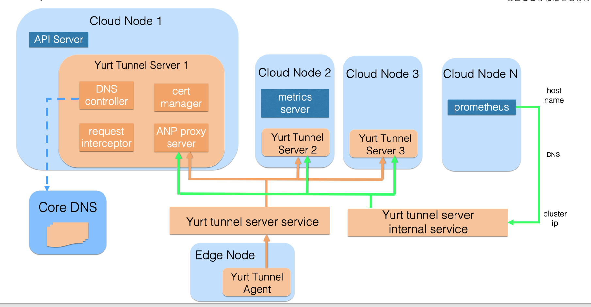
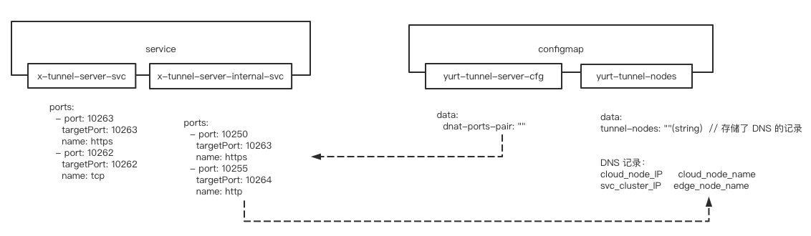
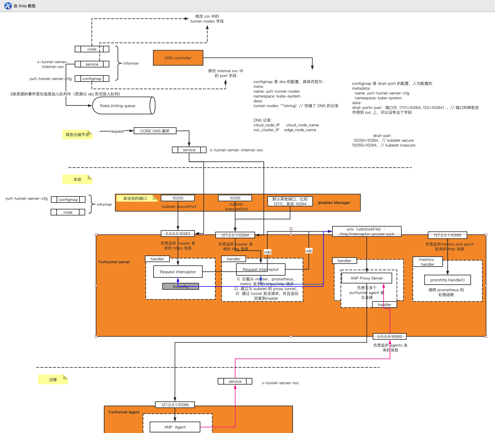
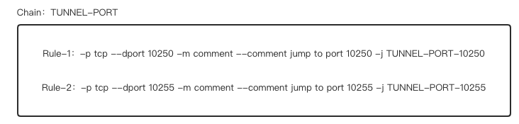
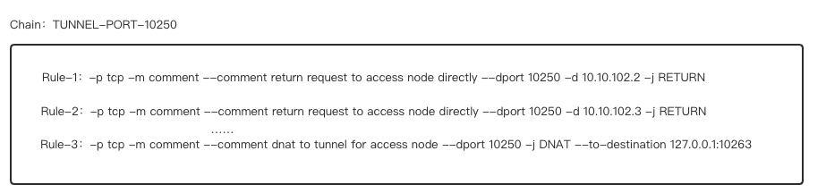
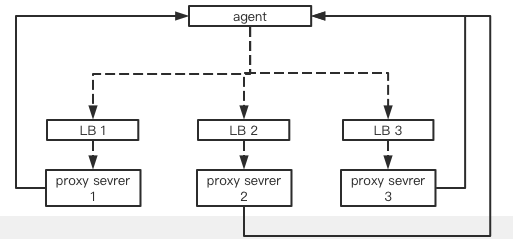
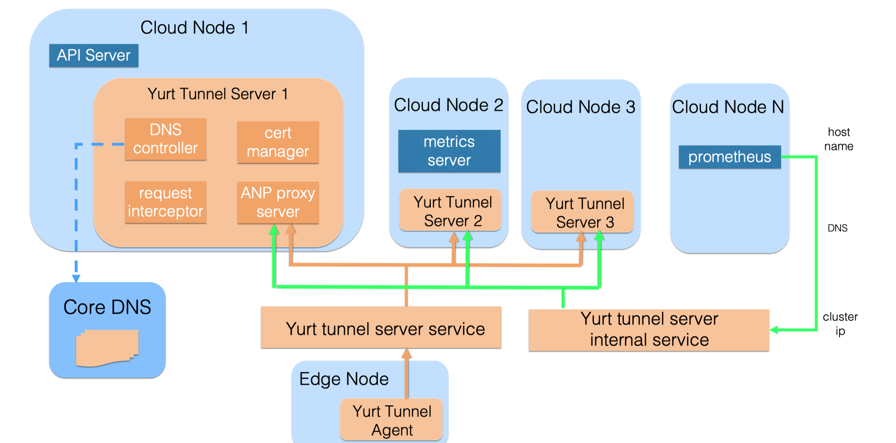
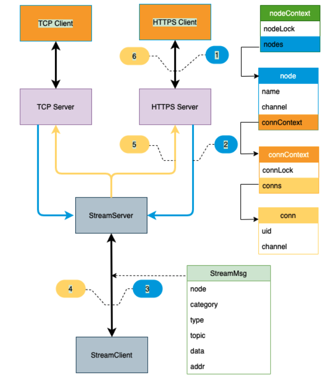
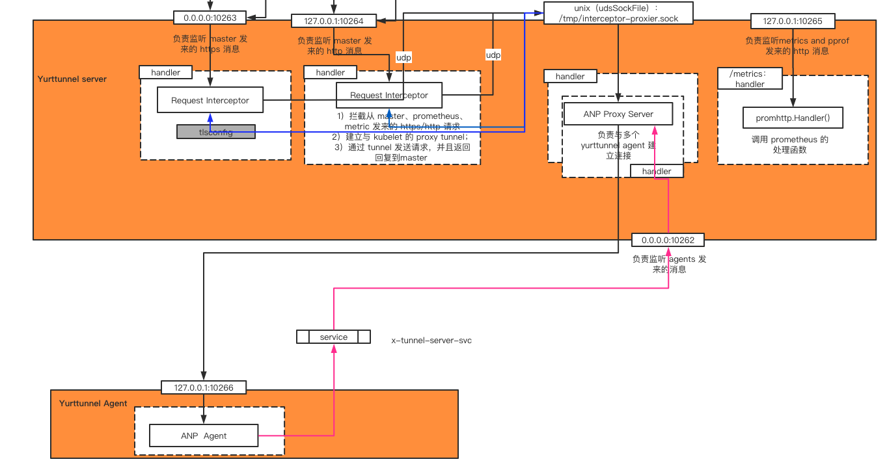
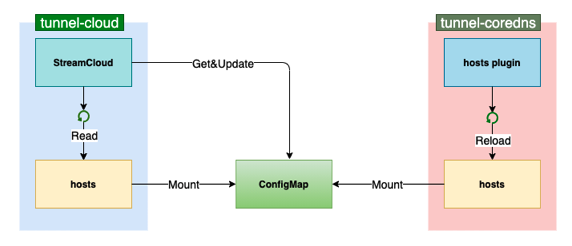

## Yurttunnel server/agent

- 工作原理

- 存在的问题&方案

- 与 ke 对比、sp对比


## 背景

单集群节点跨地域通信，解决云端无法直接访问边缘节点的问题


## 工作原理



边缘节点运行 Tunnel Agent，云端节点运行 Tunnel Server：

- Agent 通过不断访问 tunnel server service，与后端所有的 server 建立 grpc 长连接
- Tunnel server 中的 DNS controller 负责维护 node-name 和转发目的IP 的 DNS 映射
- 云端节点发送到边缘的请求，通过 DNS 解析，转发到 server internal service，之后进一步转发到后端某个 server，向边缘发送请求。

#### 主要资源



service：

- tunnel-server-svc：用于 agent 与 server 建立连接
- tunnel-server-internal-svc：用于云端节点访问边缘时的请求转发、负载均衡
  - 请求转发：通过 yurt-tunnel-server-cfg 配置

configmap：

- yurt-tunnel-server-cfg：边缘节点目的端口转发到 sevrer 的不同端口处理（10263/10264）
- yurt-tunnel-nodes：保存 DNS 记录，即 node-name 与 IP 的映射关系

#### 数据流




#### 组件

##### - iptable Manager

iptable Manager 启动之后，在 iptables 中建立 chain、rules：

- 规则建立原则：1）根据 “yurt-tunnel-server-cfg”  configmap.dnat-ports-pair 字段（10264对应的端口）+ 10250-10263 + 10255-10264；2）获取集群中的 cloud node 节点IP
- 规则的内容（以 cloud node A 为例）：（——需要 port-pair、cloud-node Ip）






- 规则的维护：同步周期为 15s，获取集群中 node 信息（获取 node IP）+configmap信息（获取 port 信息）


##### - DNS Controller

DNS controller 启动之后，将 DNS 记录更新并存储在 “yurt-tunnel-nodes”  configmap.tunnel-nodes 字段中：

- DNS 记录创建原则：根据 node 资源、tunnel-server-internal-svc、yurt-tunnel-server-cfg 资源

  1）根据集群中 node 资源的变化（add、delete、update），在 “ yurt-tunnel-nodes”  configmap.tunnel-nodes 字段进行条目的变化；2）如果 "x-tunnel-server-internal-svc" 资源 add，进行 DNS 记录的全局更新，并写入 "yurt-tunnel-nodes"；3）根据集群中 "yurt-tunnel-server-cfg" 资源的变化（add、delete、update），根据 configmap.Data[dnat-ports-pair] 字段（即传入参数 prots），将其中的 ports-pair 全部应用到 "x-tunnel-server-internal-svc" service.ports 字段上，TargetPort 都为 10264（类似 iptables 中的规则链 TUNNEL- PORT-<port> 规则设计）.

- DNS 记录内容（集群级别的内容）：（——需要 node信息、"x-tunnel-server-internal-svc"、"yurt-tunnel-server-cfg"、”yurt-tunnel-nodes“）

  对于目的地址是边缘节点，将 request 转发到 x-tunnel-server-internal-svc，通过 service，转发到某个 yurttunnel server 上，进行之后的转发；对于目的地址是云端节点，直接发送就可以。

  形式为：

  ```bash
  // DNS 记录：
  cloud_node_IP     cloud_node_name
  svc_cluster_IP    edge_node_name
  ```

  【注】"yurt-tunnel-server-cfg" configmap.dnat-ports-pair 字段是事先填好的，过程中不做改变

- 使用 DNS 记录：

  1）configmap 关联 coreDNS：将 configmap 挂载到 coreDNS 的 pod 中，配置 coreDNS 使用插件 hosts，支持定期 reload 一个文件。

  2）对于云端的组件，配置其访问节点时，使用节点 hostname，而不是 Ip。

  3）访问时，coreDNS 解析会使用 DNS 记录

- 维护 DNS 记录：每 30s 进行同步：1）获取集群中 node 信息、"x-tunnel-server-internal-svc"信息，全量更新 "yurt-tunnel-server-cfg" configmap.tunnel-nodes 字段。2）获取 "yurt-tunnel-server-cfg" dnat-ports-pair 字段，更新 "x-tunnel-server-internal-svc" 的 port 字段

##### - Yurttunnel server 

主要是使用了 k8s-sig ANP（apiserver-network-proxy）来实现 server、agent 以及他们之间的通信。

> ANP 是基于 kubernetes 1.16 Alpha 新功能 EgressSelector 开发，意在实现 Kubernetes 集群组件的跨网络通信（例如，master 位于管控 VPC，而 kubelet 等其他组件位于用户 VPC）。EgressSelector 功能允许用户在启动 KAS 时通过传入 egress configuration 来要求 KAS 将 egress 请求转发到指定的 proxy server。

- Request Interceptor

  监听10263/10264端口，将请求封装成 EgressSelector 格式

- ANP Proxy Server

  与 agent 建立连接

  

## 存在的问题 & 解决方案

- 社区新做的实现了 yurttunnel  server 不用部署在每个云端节点的问题

  已解决

- yurttunnel agent 部署在每个边缘节点的问题

  我们计划在 OpenYurt 后续发布 Yurt Unit（边缘节点分区管控）之后，配合新增的 ANP 代理转发策略，实现 agent 的分区部署，和请求的分区转发。

- Agent 需要跟所有 server 连接的问题的解决方案

  - 方案:

    agent 只连接一个 yurttunel server，之后由 yurttunnel server 进行消息的转发

  - 衍生问题：

    该机制虽然帮助我们实现了 server 副本的全网段覆盖。但同时，也存在不可忽视的缺点，由于 agent 无法选择与哪个 server 副本建立连接，因此，为了连接所有的 server 副本，agent 必须反复访问 LB。在这个过程中，server 由于还没有与所有的 agent 建立连接，KAS 发来的请求可能无法转发至对应的节点。一个潜在的解决方案是，为每个 server 副本创建一个独立的 LB，负责与 agent 之间的连接，同时在 agent 端记录所有 server 副本对应 LB 的信息，这一方案能帮助 agent 快速地与所有的 server 副本建立连接。该方案的具体实现细节，目前仍在与上游社区的开发者讨论中。

    快速建立连接：

    

- 边缘端无法主动与云端通信

  anp 社区支持


## 其他项目对比

#### Kubeedge

社区没有相关支持，可使用 frp。

  

#### Superedge 云边隧道

解决问题：单集群节点跨地域、云边网络不可靠、边缘节点位于 NAT 网络等

##### - 架构图




不同点：

server 与 agent 单连接

##### - tunnel 内部数据模块交互



类似于 yurttunnel server 的内部结构



##### - DNS 记录的维护



tunne-coredns 与 coredns 差别不大


##### - 对比

SuperEgde：固定了 tunnel-edge 与 tunnel-cloud 的连接关系：1）只有在连接时做了负载均衡，使用时无法流量分发

OpenYurt：tunnel-agent 与每一个 tunner server 都进行了连接：1）连接数过多


