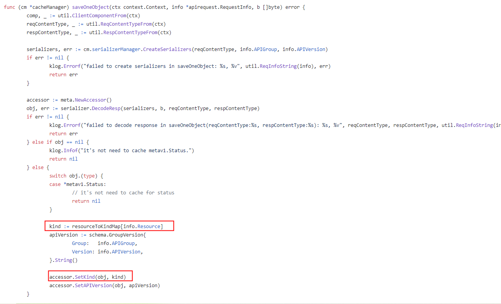
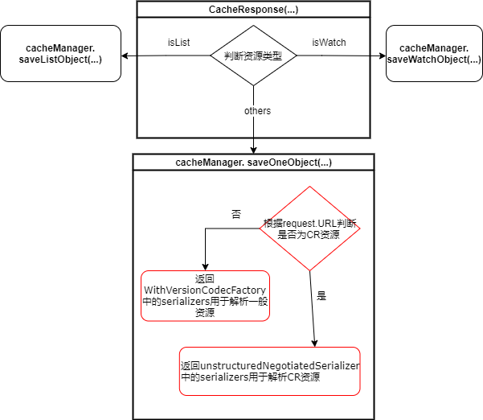

# yurthub缓存所有资源

## Table of Contents

- [Title](#title)
  - [Table of Contents](#table-of-contents)
  - [Summary](#summary)
  - [Motivation](#motivation)
    - [Goals](#goals)
  - [YurtHub现有缓存能力分析](#YurtHub现有缓存能力分析)
    - [serializerManager](#serializerManager) 
      - [问题](#问题) 
    - [cacheManager](#cacheManager) 
      - [问题](#问题) 
  - [Proposal](#proposal)
    - [删除resourceToKindMap](#删除resourceToKindMap)
      - [设计细节](#设计细节)
    - [将CR资源解码为Unstructured结构](#将CR资源解码为Unstructured结构)
      - [设计细节](#设计细节)
        - [增加unstructuredNegotiatedSerializer](#增加unstructuredNegotiatedSerializer)
        - [根据request.URL判断资源类型并选择合适的序列化器](#根据request.URL判断资源类型并选择合适的序列化器)
  - [Implementation History](#implementation-history)

## Summary

yurthub目前只能缓存[resourceToKindMap](https://github.com/openyurtio/openyurt/blob/4d7463a40801c29d09c4f7d10ba46b73cb019915/pkg/yurthub/cachemanager/cache_manager.go#L46) 和 [resourceToListKindMap](https://github.com/openyurtio/openyurt/blob/4d7463a40801c29d09c4f7d10ba46b73cb019915/pkg/yurthub/cachemanager/cache_manager.go#L62) 中限定的资源。本次proposal主要尝试提出并实现一套方案，使得yurthub不再受资源类型的限制，可以缓存CR资源。

## Motivation

when network between cloud and edge disconnected, if any pod(eg: calico) on the edge node that used some resources(like crd) not in the above map want to run continuously, that is to say, the pod can not restarted successfully because resources(like crd) are not cached by yurt-hub.

### Goals

- 解除只能缓存特定资源的限制，删除[resourceToKindMap](https://github.com/openyurtio/openyurt/blob/4d7463a40801c29d09c4f7d10ba46b73cb019915/pkg/yurthub/cachemanager/cache_manager.go#L46) 和 [resourceToListKindMap](https://github.com/openyurtio/openyurt/blob/4d7463a40801c29d09c4f7d10ba46b73cb019915/pkg/yurthub/cachemanager/cache_manager.go#L62)；
- 将未注册Golang结构的CR资源解码为Unstructured结构；
- 仿照APIServer的扩展机制，通过Delegation方式区分CR资源和核心资源，核心资源使用现有的序列化器，CR资源是用unstructureScheme。

## YurtHub现有缓存能力分析

本小节将简要分析yurthub如何接收并缓存来自kube-apiserver的response消息，涉及cacheManager和serializerManager这两个模块。yurthub缓存来自kube-apiserver的response消息中包含的资源，大致需要两步，：

step 1：将response.Body中包含的字节流解码成为内存中的runtime.Object类型，以便于yurthub针对object进行操作；

step 2：再将runtime.Object类型编码成为相应的字节流保存进硬盘中。

其中，yurthub中现有缓存能力的限制主要在第一步骤：一是[resourceToKindMap](https://github.com/openyurtio/openyurt/blob/4d7463a40801c29d09c4f7d10ba46b73cb019915/pkg/yurthub/cachemanager/cache_manager.go#L46) 和 [resourceToListKindMap](https://github.com/openyurtio/openyurt/blob/4d7463a40801c29d09c4f7d10ba46b73cb019915/pkg/yurthub/cachemanager/cache_manager.go#L62) 的限制；二是缺少对CR资源进行解码编码的序列化器。

### serializerManager

serializerManager主要用于管理解码和编码k8s资源的序列化器，serializerManager初始化时，会将client-go库中内置资源的结构体注册到scheme中，例如：

```go
type Pod struct {
   metav1.TypeMeta `json:",inline"`
   metav1.ObjectMeta `json:"metadata,omitempty" protobuf:"bytes,1,opt,name=metadata"`
   Spec PodSpec `json:"spec,omitempty" protobuf:"bytes,2,opt,name=spec"`
   Status PodStatus `json:"status,omitempty" protobuf:"bytes,3,opt,name=status"`
}
```

目前yurthub只能编码和解码这些Group/Version下的api对象：

```go
admissionregistrationv1 "k8s.io/api/admissionregistration/v1"
admissionregistrationv1beta1 "k8s.io/api/admissionregistration/v1beta1"
appsv1 "k8s.io/api/apps/v1"
appsv1beta1 "k8s.io/api/apps/v1beta1"
appsv1beta2 "k8s.io/api/apps/v1beta2"
auditregistrationv1alpha1 "k8s.io/api/auditregistration/v1alpha1"
authenticationv1 "k8s.io/api/authentication/v1"
authenticationv1beta1 "k8s.io/api/authentication/v1beta1"
authorizationv1 "k8s.io/api/authorization/v1"
authorizationv1beta1 "k8s.io/api/authorization/v1beta1"
autoscalingv1 "k8s.io/api/autoscaling/v1"
autoscalingv2beta1 "k8s.io/api/autoscaling/v2beta1"
autoscalingv2beta2 "k8s.io/api/autoscaling/v2beta2"
batchv1 "k8s.io/api/batch/v1"
batchv1beta1 "k8s.io/api/batch/v1beta1"
batchv2alpha1 "k8s.io/api/batch/v2alpha1"
certificatesv1beta1 "k8s.io/api/certificates/v1beta1"
coordinationv1 "k8s.io/api/coordination/v1"
coordinationv1beta1 "k8s.io/api/coordination/v1beta1"
corev1 "k8s.io/api/core/v1"
discoveryv1alpha1 "k8s.io/api/discovery/v1alpha1"
eventsv1beta1 "k8s.io/api/events/v1beta1"
extensionsv1beta1 "k8s.io/api/extensions/v1beta1"
networkingv1 "k8s.io/api/networking/v1"
networkingv1beta1 "k8s.io/api/networking/v1beta1"
nodev1alpha1 "k8s.io/api/node/v1alpha1"
nodev1beta1 "k8s.io/api/node/v1beta1"
policyv1beta1 "k8s.io/api/policy/v1beta1"
rbacv1 "k8s.io/api/rbac/v1"
rbacv1alpha1 "k8s.io/api/rbac/v1alpha1"
rbacv1beta1 "k8s.io/api/rbac/v1beta1"
schedulingv1 "k8s.io/api/scheduling/v1"
schedulingv1alpha1 "k8s.io/api/scheduling/v1alpha1"
schedulingv1beta1 "k8s.io/api/scheduling/v1beta1"
settingsv1alpha1 "k8s.io/api/settings/v1alpha1"
storagev1 "k8s.io/api/storage/v1"
storagev1alpha1 "k8s.io/api/storage/v1alpha1"
storagev1beta1 "k8s.io/api/storage/v1beta1"
v1 "k8s.io/apimachinery/pkg/apis/meta/v1"
runtime "k8s.io/apimachinery/pkg/runtime"
schema "k8s.io/apimachinery/pkg/runtime/schema"
serializer "k8s.io/apimachinery/pkg/runtime/serializer"
utilruntime "k8s.io/apimachinery/pkg/util/runtime"
```

#### 问题

由于scheme目前只保存了上述固定资源类型的结构，当yurthub接收来自kube-apiserver返回的CR资源时，无法找到对应的go类型结构解码CR。（可以找下正常解码的流程图）

### cacheManager

cacheManager提供了一些方法，用于管理缓存在边缘节点的资源，作用主要分为三个：

- 判断response消息是否需要缓存
- 将来自kube-apiserver的资源字节流解码为runtim.Object形式保存到内存中，并经过操作后转换为字节流形式存储到硬盘中
- 当云边通信不健康时，边缘节点通过QueryCache来查找缓存在本地的资源。

```go
// CacheManager is an adaptor to cache runtime object data into backend storage
type CacheManager interface {
	CacheResponse(ctx context.Context, prc io.ReadCloser, stopCh <-chan struct{}) error
	QueryCache(req *http.Request) (runtime.Object, error)
	UpdateCacheAgents(agents []string) error
	ListCacheAgents() []string
	CanCacheFor(req *http.Request) bool
}
```

#### 问题

由于目前yurthub使用的序列化器解码资源对象时，会丢失gvk信息，因此需要[resourceToKindMap](https://github.com/openyurtio/openyurt/blob/4d7463a40801c29d09c4f7d10ba46b73cb019915/pkg/yurthub/cachemanager/cache_manager.go#L46) 和 [resourceToListKindMap](https://github.com/openyurtio/openyurt/blob/4d7463a40801c29d09c4f7d10ba46b73cb019915/pkg/yurthub/cachemanager/cache_manager.go#L62) 根据resource获取相应的kind信息，这两个map的作用主要有以下三个：

- CanCacheFor(req *http.Request)函数使用resourceToKindMap判断response消息是否需要缓存

- saveOneObject、saveListObject、saveWatchObject三个函数使用resourceToKindMap获取资源对应的kind信息, 用于缓存response消息。

  由于解析出来的object并不包含gvk信息。而缓存对象时, 需要设置gvk信息，其中两个map预先保存了部分resource到kind的映射, 可以用于缓存资源时, 根据request URL中的resource名称来获取相应的kind。

  

- queryListObject函数使用resourceToListKindMap成员用于查询List对象

由于上述限制，yurthub目前只能缓存[resourceToKindMap](https://github.com/openyurtio/openyurt/blob/4d7463a40801c29d09c4f7d10ba46b73cb019915/pkg/yurthub/cachemanager/cache_manager.go#L46) 和 [resourceToListKindMap](https://github.com/openyurtio/openyurt/blob/4d7463a40801c29d09c4f7d10ba46b73cb019915/pkg/yurthub/cachemanager/cache_manager.go#L62)中限定的资源。

## Proposal

### 删除[resourceToKindMap](https://github.com/openyurtio/openyurt/blob/4d7463a40801c29d09c4f7d10ba46b73cb019915/pkg/yurthub/cachemanager/cache_manager.go#L46) 和 [resourceToListKindMap](https://github.com/openyurtio/openyurt/blob/4d7463a40801c29d09c4f7d10ba46b73cb019915/pkg/yurthub/cachemanager/cache_manager.go#L62)

通过删除[resourceToKindMap](https://github.com/openyurtio/openyurt/blob/4d7463a40801c29d09c4f7d10ba46b73cb019915/pkg/yurthub/cachemanager/cache_manager.go#L46) 和 [resourceToListKindMap](https://github.com/openyurtio/openyurt/blob/4d7463a40801c29d09c4f7d10ba46b73cb019915/pkg/yurthub/cachemanager/cache_manager.go#L62) 来解除只能缓存特定资源的限制。删除上述限制需要解决以下问题：在解码相应资源时，保留原本的gvk信息；The reason why obj misses the field of apiverison and kind is yurthub using [serializer.WithoutConversionCodecFactory](https://github.com/alibaba/openyurt/blob/7095962687e2666a27d14e436b96ef893b228beb/pkg/yurthub/kubernetes/serializer/serializer.go#L48) as NegotiatedSerializer, which produces [WithoutVersionDecoder ](https://github.com/kubernetes/kubernetes/blob/994b5c6cc20bda188ac9bc33217f2dbc7ecf45bb/staging/src/k8s.io/apimachinery/pkg/runtime/helper.go#L256)and remove the apiversion/kind of object when serialized from http.resp. 下述代码是yurthub目前解码资源时实际调用的解码器：

```go
// Decode does not do conversion. It removes the gvk during deserialization.
func (d WithoutVersionDecoder) Decode(data []byte, defaults *schema.GroupVersionKind, into Object) (Object, *schema.GroupVersionKind, error) {
	obj, gvk, err := d.Decoder.Decode(data, defaults, into)
	if obj != nil {
		kind := obj.GetObjectKind()
		// clearing the gvk is just a convention of a codec
		kind.SetGroupVersionKind(schema.GroupVersionKind{})
	}
	return obj, gvk, err
}
```

#### 设计细节

自定义一个新的WithVersionCodecFactory取代原来的[serializer.WithoutConversionCodecFactory](https://github.com/alibaba/openyurt/blob/7095962687e2666a27d14e436b96ef893b228beb/pkg/yurthub/kubernetes/serializer/serializer.go#L48) 作为NegotiatedSerializer，可以在解码资源的时候保留gvk信息。下面是部分WithVersionCodecFactory的相关代码。

```go
// WithVersionCodecFactory is a CodecFactory that will explicitly ignore requests to perform conversion.
// It keeps the gvk during deserialization.
// This wrapper is used while code migrates away from using conversion (such as external clients)
type WithVersionCodecFactory struct {
	serializer.CodecFactory
}

// DecoderToVersion returns an decoder that does not do conversion, and keeps the gvk information
func (f WithVersionCodecFactory) DecoderToVersion(serializer runtime.Decoder, _ runtime.GroupVersioner) runtime.Decoder {
	//return versioning.NewDefaultingCodecForScheme(s.scheme, nil, decoder, nil, gv)
	return WithVersionDecoder{
		Decoder: serializer,
	}
}

// WithVersionDecoder keeps the group version kind of a deserialized object.
type WithVersionDecoder struct {
	runtime.Decoder
}

// Decode does not do conversion. It keeps the gvk during deserialization.
func (d WithVersionDecoder) Decode(data []byte, defaults *schema.GroupVersionKind, into runtime.Object) (runtime.Object, *schema.GroupVersionKind, error) {
	obj, gvk, err := d.Decoder.Decode(data, defaults, into)
	return obj, gvk, err
}
```

### 将CR资源解码为Unstructured结构

Unstructured allows objects that do not have Golang structs registered to be manipulated generically. This can be used to deal with the API objects from a plug-in. 

```go
//Unstructured objects still have functioning TypeMeta features-- kind, version, etc.
type Unstructured struct {
   // Object is a JSON compatible map with string, float, int, bool, []interface{}, or
   // map[string]interface{}
   // children.
   Object map[string]interface{}
}
```

#### 设计细节

##### 增加unstructuredNegotiatedSerializer
在现有NegotiatedSerializer的基础上增加一个新的unstructuredNegotiatedSerializer，用于解码未注册Golang结构的CR资源。

```go
type unstructuredNegotiatedSerializer struct {
	scheme  *runtime.Scheme
	typer   runtime.ObjectTyper
	creator runtime.ObjectCreater
}

// SerializerManager is responsible for managing *rest.Serializers
type SerializerManager struct {
	// NegotiatedSerializer is used for obtaining encoders and decoders for multiple
	// supported media types.
	NegotiatedSerializer runtime.NegotiatedSerializer
    //TO-ADD: use to decode the CR
    unstructuredNegotiatedSerializer runtime.NegotiatedSerializer
}
```
##### 根据request.URL判断资源类型并选择合适的序列化器

当缓存资源显示，根据reques.URL判断资源是什么类型，如果是内置资源，则使用原本的序列化器，如果是CR资源则使用NewUnstructuredNegotiatedSerializer返回的序列化器进行解析。



## Implementation History

- [ ] 03/01/2021: Proposed idea in an issue or [community meeting]
- [ ] 03/01/2021: 提交删除[resourceToKindMap](https://github.com/openyurtio/openyurt/blob/4d7463a40801c29d09c4f7d10ba46b73cb019915/pkg/yurthub/cachemanager/cache_manager.go#L46) 和 [resourceToListKindMap](https://github.com/openyurtio/openyurt/blob/4d7463a40801c29d09c4f7d10ba46b73cb019915/pkg/yurthub/cachemanager/cache_manager.go#L62) 的PR (https://github.com/openyurtio/openyurt/pull/225)
- [ ] 03/03/2021: openyurt会议上进行proposal分享
